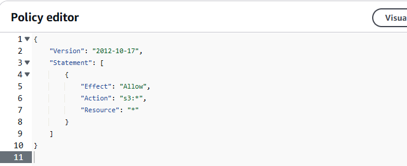
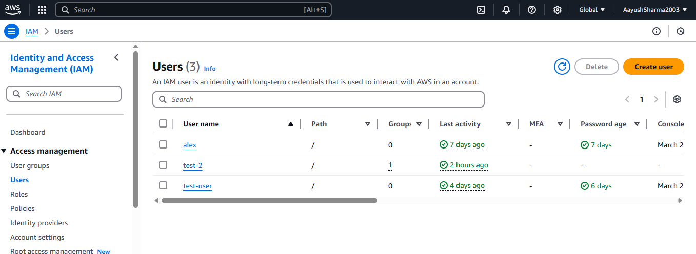
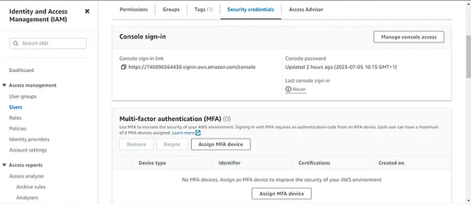

# Steps to Create IAM Role, Policy, and Enable MFA

## Step 1: Sign in to AWS Console
- Go to the AWS Management Console and log in.

### Create Custom IAM Policy
- Navigate to **IAM > Policies > Create policy**.
- Define permissions (JSON or Visual editor) and create the policy.

## Step 2: Create Custom IAM Role (if needed)
- Go to **IAM > Roles > Create role**.
- Select trusted entity and attach the custom policy.
- Name and create the role.

## Step 3: Attach Policy to IAM User
- Go to **IAM > Users > select user**.
- Click on **Permissions > Add permissions**.
- Attach the custom policy and confirm.

## Step 4: Enable MFA for IAM User
- In user details, go to **Security credentials**.
- Click **Assign MFA device**.
- Choose device type, configure, and assign.

## Step 5: Test Configuration
- Log in as the IAM user to verify permissions and MFA setup.

---
 
