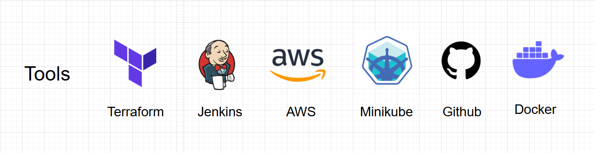
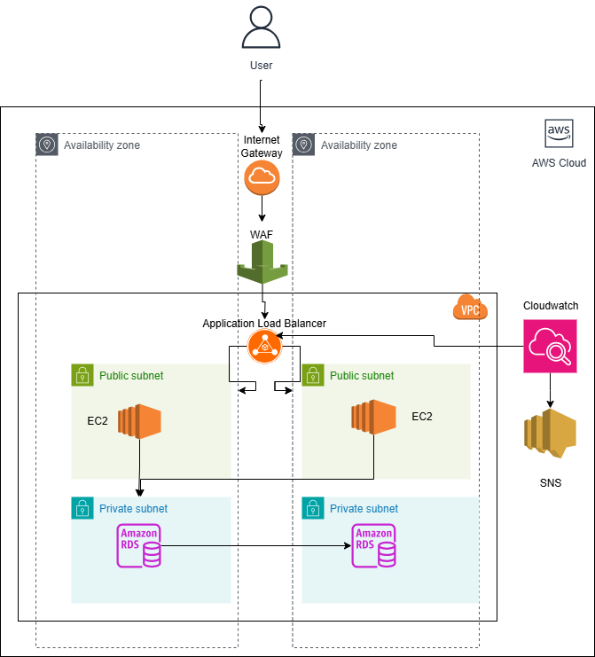
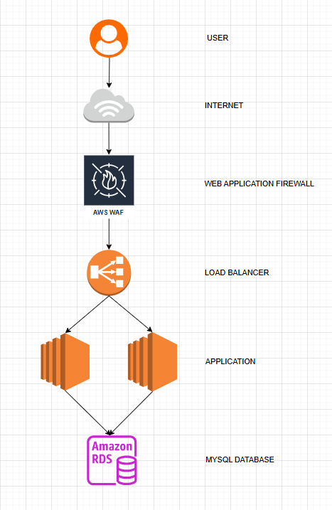
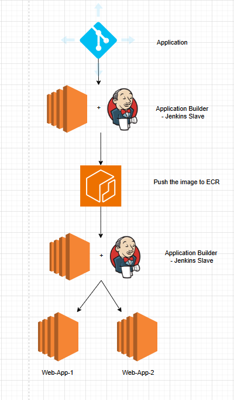
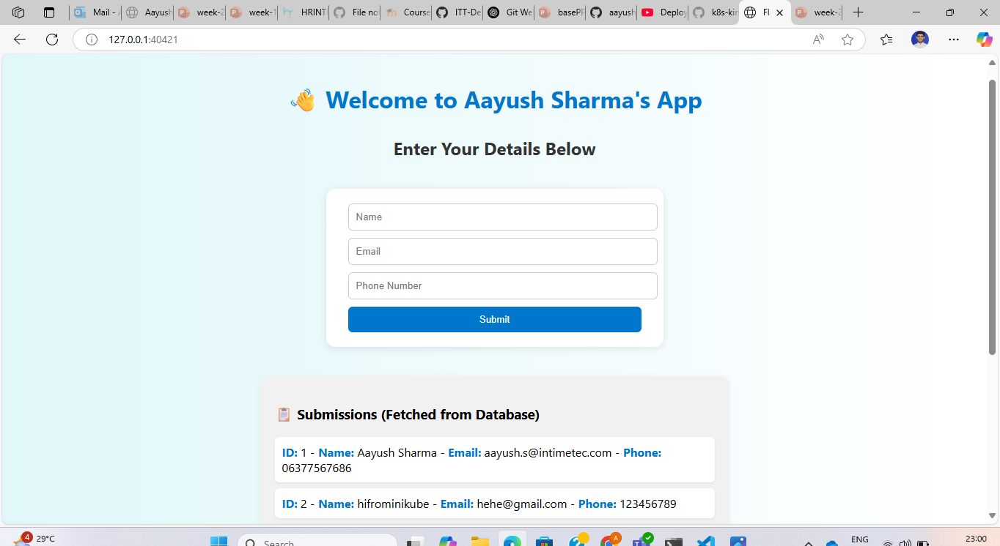

# 🚀 Final DevOps Project — Web App Deployment on AWS with RDS Backend

This project demonstrates the complete infrastructure setup and CI/CD pipeline automation for deploying a **Python Flask web application** with a **MySQL RDS backend** on **AWS Cloud**, using best practices and DevOps tools covered over the last 8 weeks.

---

## 🧰 Tools & Technologies Used

- **Terraform** – Infrastructure as Code  
- **Jenkins** – CI/CD Pipeline  
- **Docker** – Containerization  
- **Amazon Web Services (AWS)** – Cloud Infrastructure  
- **Kubernetes (Minikube)** – Local container orchestration  
- **GitHub** – Source Control & Webhooks  

---

## 🏗️ Architecture Overview

### 🔄 Application Flow

**Architecture Highlights:**

- Users access the application **via the internet**.
- Traffic first passes through **AWS WAF (Web Application Firewall)** to block malicious requests.
- Requests reach the **Application Load Balancer (ALB)**.
- The ALB routes traffic to two **EC2 instances** (Web App 1 and Web App 2) deployed in **public subnets** for high availability.
- EC2 instances communicate with a **MySQL RDS** database located in a **private subnet**.
- The setup runs inside a **custom VPC**, ensuring security, isolation, and network segmentation as per AWS best practices.

---

## 🔁 CI/CD Pipeline Flow

This project uses Jenkins pipelines to automate both infrastructure provisioning and application deployment.

### 🧩 Flow Description:

1. Developer pushes code to the [**Application Code Repository**](https://github.com/aayushITT/Terraform-application-infra).
2. Jenkins master triggers a job on the **Jenkins agent/slave** via GitHub webhook.
3. The agent:
   - Builds a **Docker image** from the Flask application.
   - Pushes the image to **Amazon Elastic Container Registry (ECR)**.
4. A second Jenkins job:
   - Pulls the image from ECR.
   - Deploys it to **two EC2 instances** using secure SSH.
5. Infrastructure provisioning (VPC, EC2, RDS, ALB, IAM, etc.) is handled through a Jenkins pipeline using [**Terraform Infrastructure Repository**](https://github.com/aayushITT/terraform-Infra).

---

## 📂 GitHub Repositories

- 🧱 **Infrastructure Code (Terraform + Jenkinsfile)**  
  🔗 [terraform-Infra](https://github.com/aayushITT/terraform-Infra)

- 🌐 **Web Application Code (Python Flask)**  
  🔗 [Terraform-application-infra](https://github.com/aayushITT/Terraform-application-infra)

---

## 🧪 Local Deployment with Minikube 

Run the Flask web application and MySQL database on your local Minikube cluster

Output on browser:

