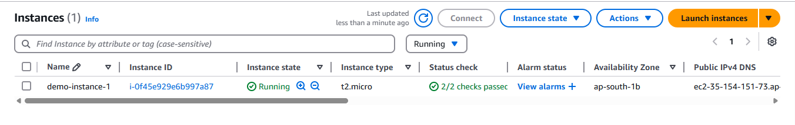
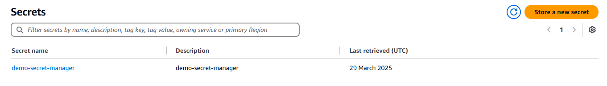
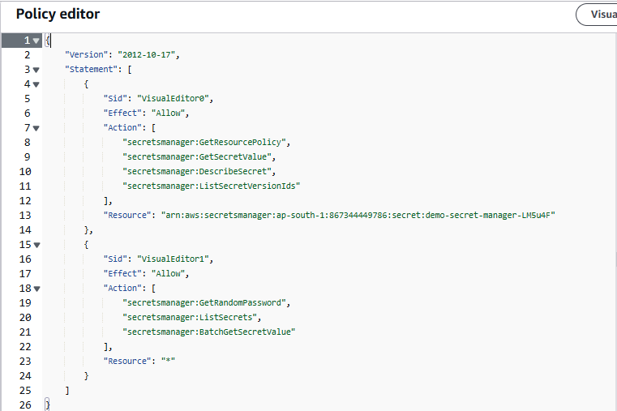
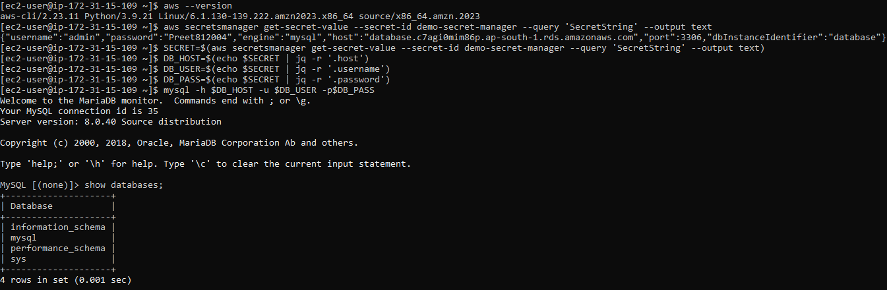

**Assignment 1: Deploy a sample application on EC2 instance that should store data on RDS. Use AWS secrets manager for storing the connection strings**

1. Create an EC2 instance

Step 1. Select EC2 service and click on launch instance.

Step 2. Add name to the instance and choose amazon linux as operating system.

Step 3. Click on launch instance.

2. Create RDS database

Step 1. Select RDS service and click on create DB instance.

Step 2. Select standard create and choose engine option as "MySQL".

Step 3. Choose free tier template and add database name, user name and password.

Step 4. Choose VPC same in which the EC2 instance is created.

Step 5. Select "No" to public access and click on create database.

.png)

3. Create Secrets

Step 1. Select AWS secret manager service and click on create secret.

Step 2. Select secret type to RDS database and add username, password, choose encryption type and add database.

Step 3. Configure the secret by adding name to secret and click on review and save to create a secret.

4. Create a role

Step 1. Select IAM service and click on create role.

Step 2. Select EC2 as AWS service to the role and attach below policy to the role.

Step 3. Click on create role.

5. Attach role to the EC2

Step 1. Select the created EC2 instance and click on actions.

Step 2. Select security and click on modify IAM role.

Step 3. Attach role created and click on save changes.

6. Connect to RDS thorugh EC2 using secret manager to access database credentials

Step 1. Connect to EC2 instance using command :

# ssh -i <path of key pair> ec2_user@<public ip address>

Step 2. Check for aws cli by running command :

# aws --version

Step 3. Install mysql-client by running these commands:

# sudo apt update
# sudo dnf install mariadb105

Check if mysql is installed or not :

# mysql --version

Step 4. Run this command to get database access credentials:

# aws secretsmanager get-secret-value --secret-id demo-secret-manager --query 'SecretString' --output text

Step 5. Store access credentials in variables:

# SECRET=$(aws secretsmanager get-secret-value --secret-id demo-secret-manager --query 'SecretString' --output text)

# DB_HOST=$(echo $SECRET | jq -r '.host')

# DB_USER=$(echo $SECRET | jq -r '.username')

# DB_PASS=$(echo $SECRET | jq -r '.password')

Step 6. Access mysql using this command:

# mysql -h $DB_HOST -u $DB_USER -p$DB_PASS

**Assignment 2:Create alarm in cloudwatch on the basis of average CPU utilisation for a VM**