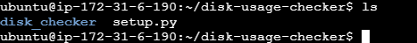
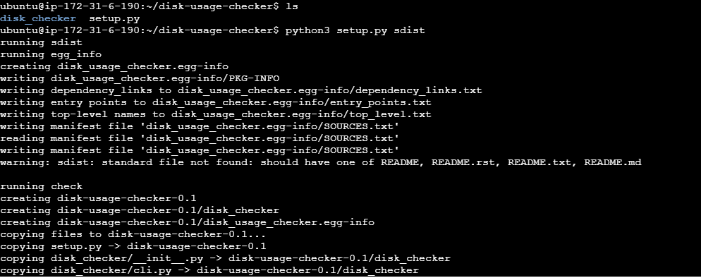
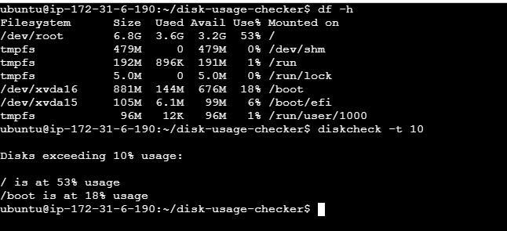
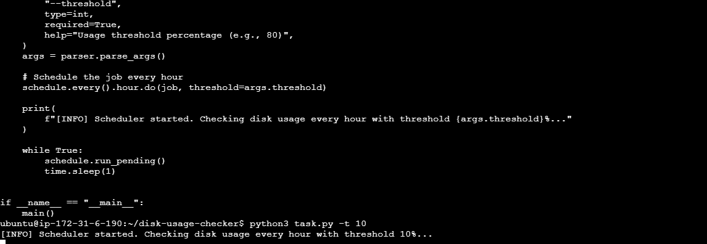

**Assignment: Package one of your scripts as a CLI tool and schedule it to run every hour using schedule or cron.**

1. Created required folder structure for packaging script, where cli.py containes main pyhton code.

2. Run the following commands to create package locally.

3. Package was installed in machine loacally and used as cli.

4. assignment.py is python script for scheduling this package created after every one hour.

