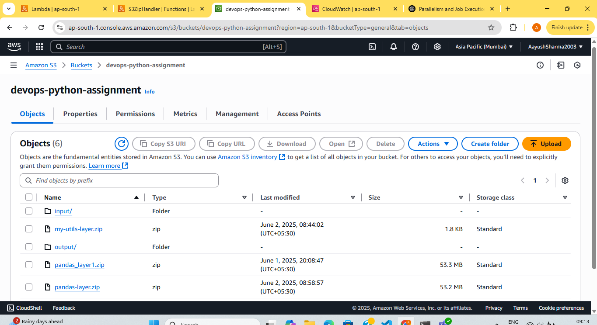
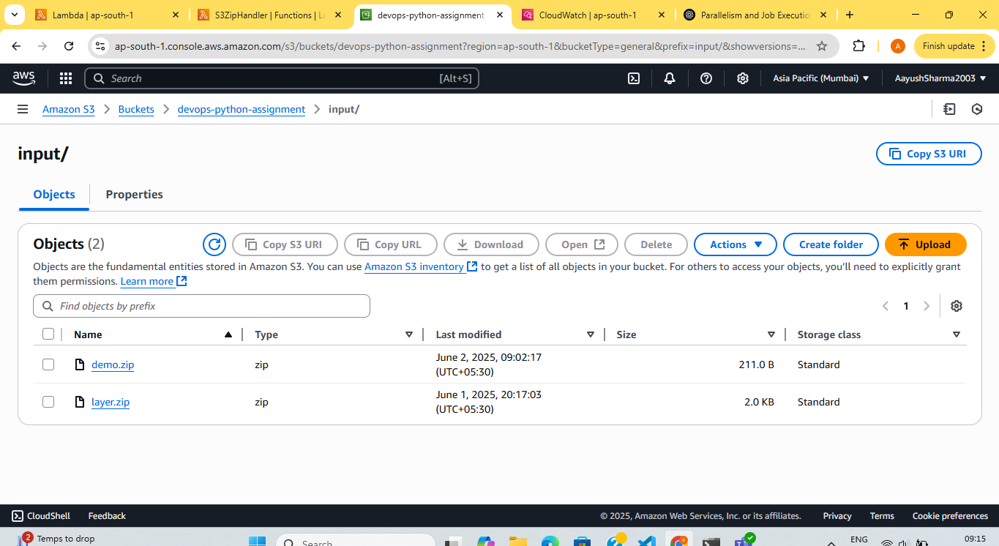
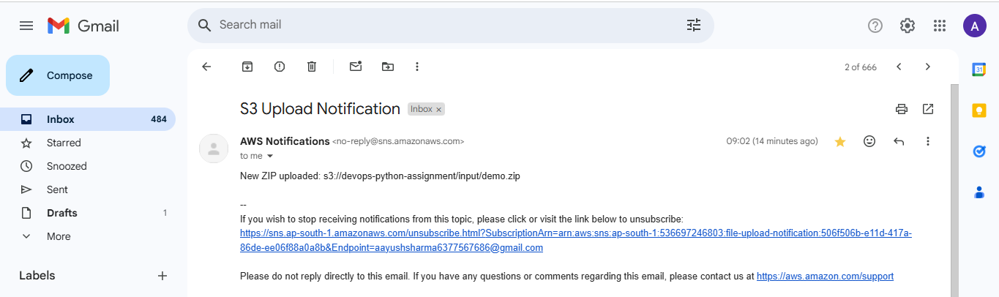
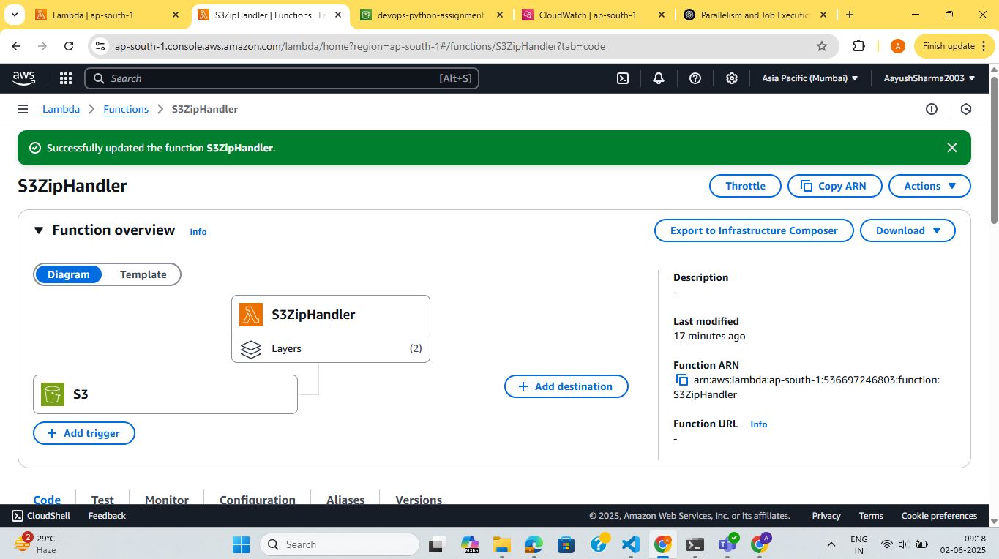
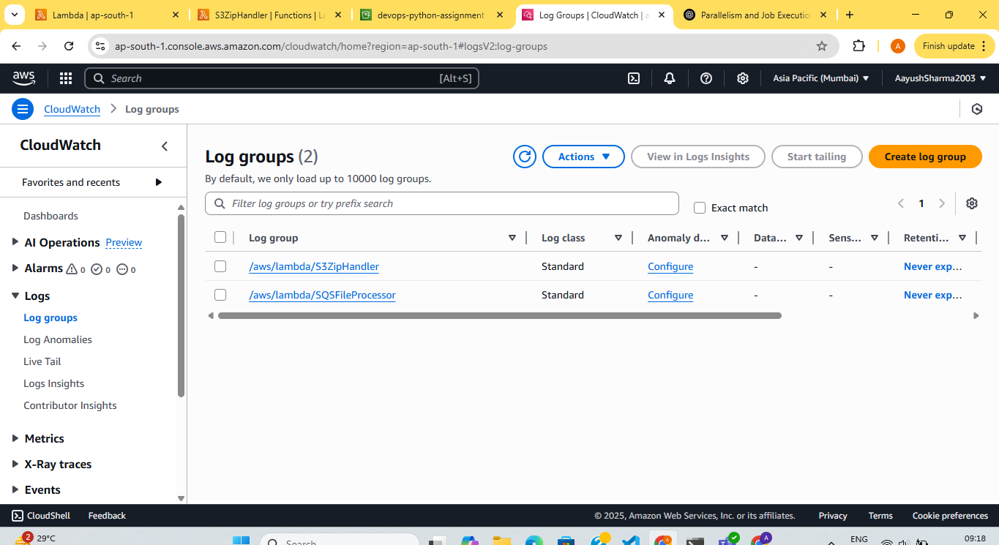
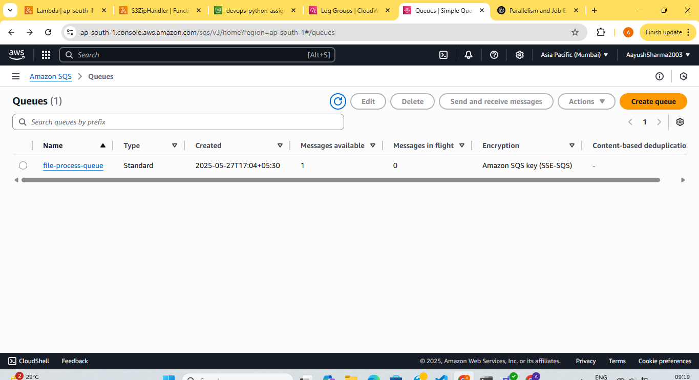

## Assignment: Objective

### Build an end-to-end serverless workflow using Python and AWS to process files uploaded to an S3 bucket. This simulates a real-world DevOps automation use case. Use Case Flow Trigger: A .zip file is uploaded to an input S3 bucket (e.g., devops-python-assignment/input/).

Triggered on S3 PUT event (zip file uploaded to S3 bucket)

Sends an email using SNS to notify upload success

Sends a message to SQS with the S3 file path

Lambda Function :

Lambda should be triggered from Event Bridge

Reads the SQS message

Downloads and extracts the zip file

Transforms the content (e.g., convert .txt/.json to .csv)

Uploads the transformed file to output S3 bucket (e.g., devops-python-assignment/output/)

Key Expectations Reusable, modular code with clear function names and error handling

Implement a class for SQS logic and use inheritance in the main handler. All the functions related to SQS viz. fetch & Delete should be implemented here. Use boto3 for all AWS interactions

Add comments, and logging for clarity.

Students should structure their code as a Git repo with the following: aws-file-pipeline/ │

├── lambda/

│ ├── s3_event_handler.py # Lambda 1: Handles zip upload, triggers SNS + SQS

│ ├── sqs_processor.py # Lambda 2: Reads from SQS and processes file

│ └── utils/

     # SNS publish logic
│ ├── sqs_helper.py # Reusable SQS client class

│ └── s3_helper.py # Download/Upload S3 utilities

│

├── requirements.txt # Python packages used (boto3, pandas, etc.)

├── README.md # Project overview, setup, and deployment instructions

Created S3 bucket with input and output folder:

When zip file uploaded to input folder of S3 bucket .txt and .json files are converted to .csv files in output folder.

Upload confirmation is also sent to email via SNS service:

- Lambda Zip handler

- Cloud Watch

- SQS

