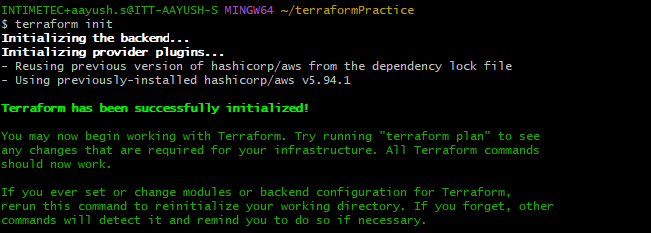
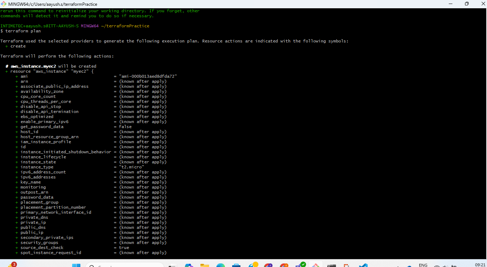

**Assignment: Create a VPC and Subnets in AWS using Terraform**

After writing the code for the infrastructure of VPC, subnet(public and private), route table(public and private) and internet gateway, run the following commands:

# terraform init

# terraform plan

# terraform apply

Final Output:

.png)