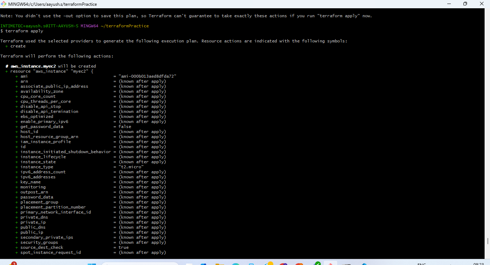

Assignment: Create EC2 instance (Windows/Linux) using Terraform inside the previously created VPC & Subnet

Created an EC2 instance in public subnet created in VPC.
1.Terraform plan
  
2.Terraform apply
   
3-Ec2
 