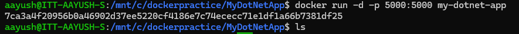

**Assignment: Create Dockerfile to build and run .NET core application**

#### Run docker command to build image from dockerfile:
docker build -t my-dotnet-app .
.png)

Create container from the image using command:
docker run -d -p 5000:5000 my-dotnet-app

See on web browser by searching  
http://localhost:5000/

.png)

