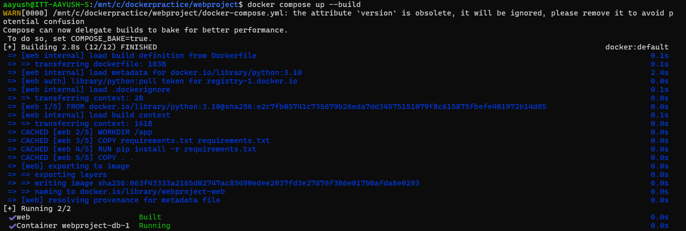

# Objective
The goal of this project is to deploy a simple web application with a form for user name and email. The web application and database are hosted in separate containers. The application should be able to interact with the database, storing user information in a `users` table.

## Steps

### Step Run the following commands:

docker compose up

Run localhost:5000 on browser and enter details:
.png)

.png)

.png)

