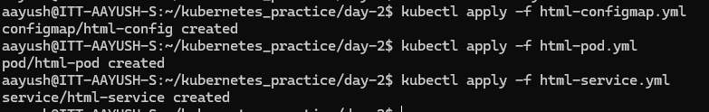
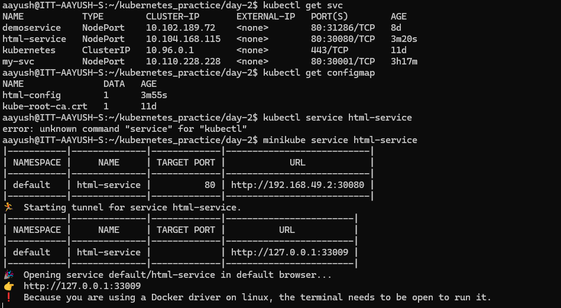
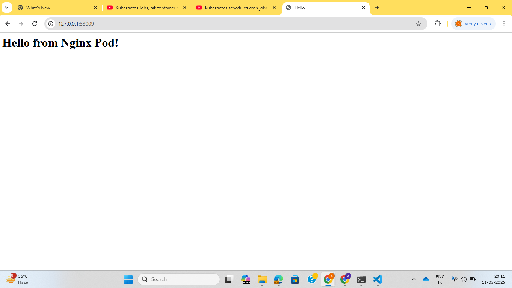

**Assignment: Create a pod with a basic HTML page and service to expose that pod.**

Create a configMap with html-configMap.yaml file using command:

```kubectl create -f html-configMap.yaml```

Create a pod with html-pod.yaml file using command:

```kubectl create -f html-pod.yaml```

Create service with html-service.yaml file using command:

```kubectl create -f html-service.yaml```



Now run command:

```minikube service <service_name>```



Redirect to url http://127.0.0.1:33009

