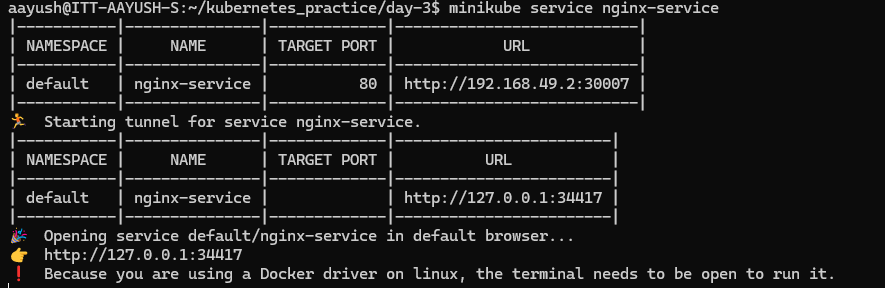
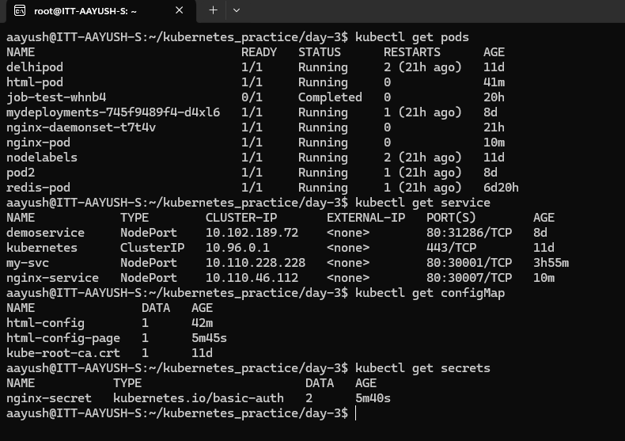
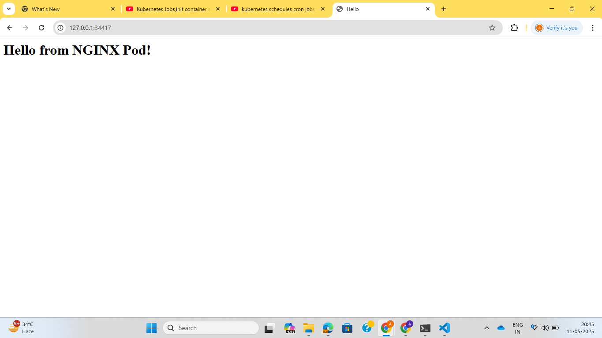

**Assignment: Create config maps, secrets, and volumes and assign them to already created pods.**

First create a simple pod without any secret, config maps and volumes and expose the pod.

Now create config map and secrets and run kubectl create command:

Now delete the current pod and apply the changes in pod.yaml file and again create the pod using kubectl create command:

Now see the webpage:

