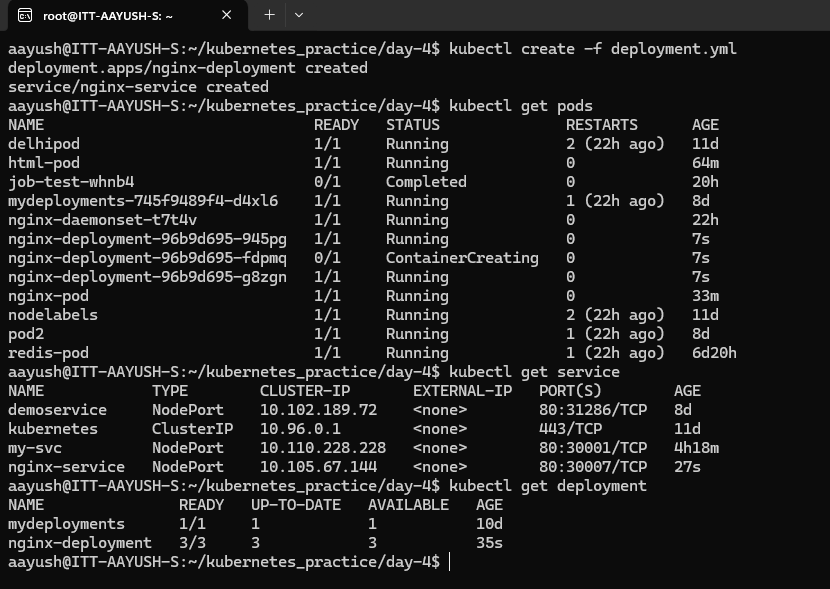
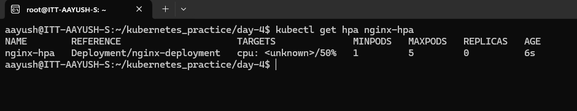
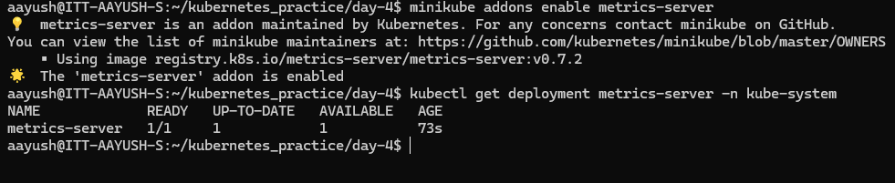
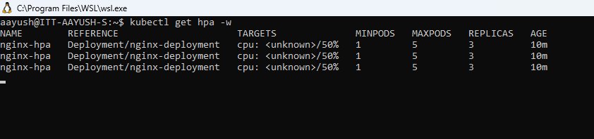

**Assignment: Create a Deployment with 3 replicas of a NGNIX web app, create hpa and assign auto scaling.**

Create deployment.yaml file with 3 replicas of nginx server along with service exposing the port 80 and run the command:

```kubectl create -f deployment.yaml```

it will create deployment, replica set and pods objects along with service object.



Now create horizontal pod autoscaler in declarative way and run command:

```kubectl create -f hpa.yaml```



Also need to use a cluster that has a Metrics Server deployed and configured. Run the following command to enable metrics-server:

```minikube addons enable metrics-server```



Now to check hpa working increase the load using this command:

```kubectl run -i --tty load-generator --rm --image=busybox:1.28 --restart=Never -- /bin/sh -c "while true; do wget -q -O- http://nginx-service > /dev/null; done"```

In a separate terminal, watch the HPA scale your deployment:


