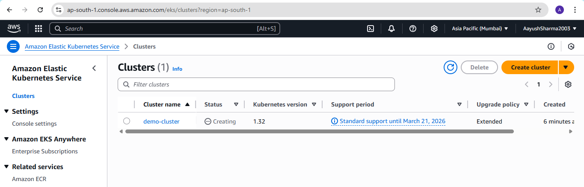
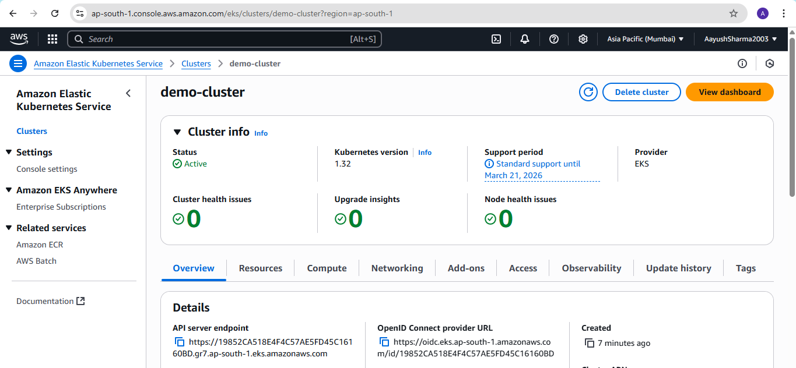
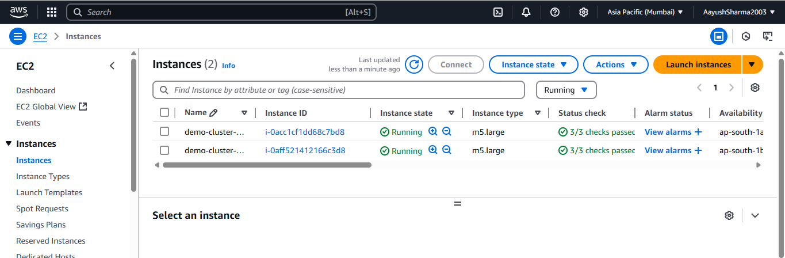
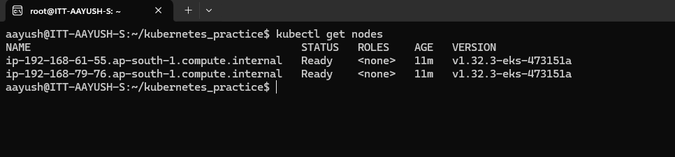

**Assignment: Create a public EKS cluster. Configure your local system to access and manage the cluster.**

Create a user with eks acces roles and policy attached to it.

Install aws cli, kubectl and eksctl on local system.

Configure access keys and secret access keys on local system using command:

```aws configure```

Create public EKS cluster using eksctl command:

```eksctl create cluster --name demo-cluster --region ap-south-1 --nodegroup-name demo-node-group --nodes 2 --managed```

Now on aws console we can see public cluster is created



Cluster with 2 nodes:



Two nodes as EC2:



We can access and manage from local system

Run command:

```kubectl get nodes```


