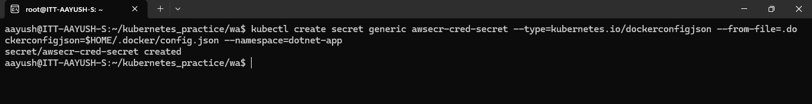

**Assignment: Use the ECR image created for the .Net application and deploy it on minikube. The Application in the pod should be accessible on the browser. Assign suitable resource limits and requests on namsepace and deployment levels respectively.**

Docker image is created from dockerfile using command:

``` docker build -t dotnet-image .```

Image is pushed to ECR using commands:

```aws ecr get-login-password --region ap-south-1 | docker login --username AWS --password-stdin 536697246803.dkr.ecr.ap-south-1.amazonaws.com```

```docker tag new_dotnet_image:latest 536697246803.dkr.ecr.ap-south-1.amazonaws.com/new_dotnet_image:latest```

```docker push 536697246803.dkr.ecr.ap-south-1.amazonaws.com/new_dotnet_image:latest```

Now starting minikube on local machine:
```minikube start```

Login to ECR using command:
```aws ecr get-login-password --region ap-south-1 | docker login --username AWS --password-stdin 536697246803.dkr.ecr.ap-south-1.amazonaws.com```


Create namespace and resourcequota from namespace.yaml file using command:

```kubectl apply -f namespace.yaml```


Create secret for docker configuration using command:

```kubectl create secret generic awsecr-cred-secret --type=kubernetes.io/dockerconfigjson --from-file=.dockerconfigjson=$HOME/.docker/config.json --namespace=dotnet-app```



Create deployment from deployment.yaml file using command:

```kubectl apply -f deployment.yaml```


Expose the deployment or pods to browser from service.yaml file using command:

```kubectl apply -f service.yaml```


We can see the pods in running status:


Now run the command:

```minikube service helloworld-service -n dotnet-app```


Now run http://127.0.0.1:35441 on browser and check:

