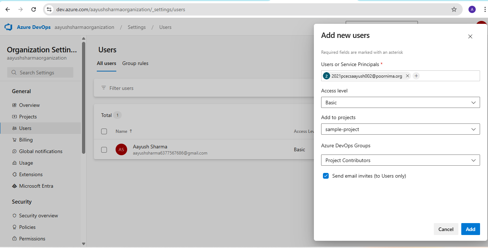
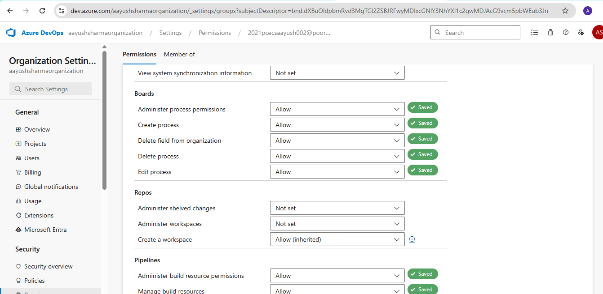
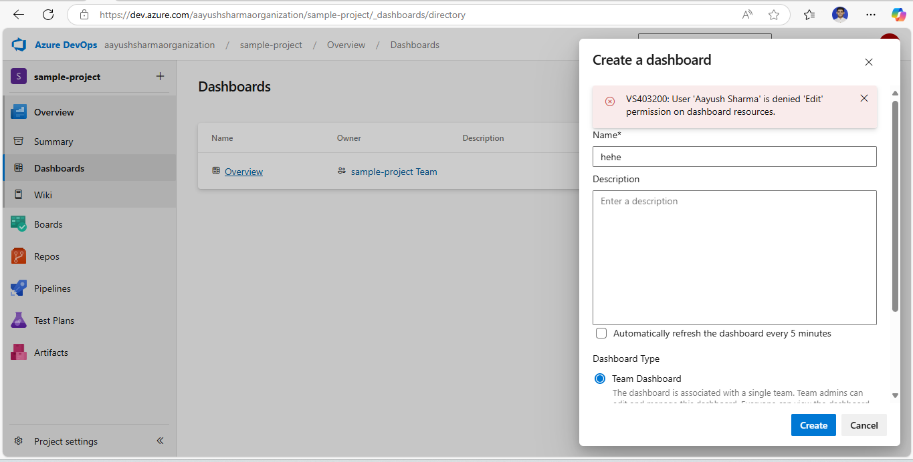

**Assignment: Add a new team member to the organization with access to Azure Boards & Pipelines.**

1. Select organizational settings

2. Select Users and click on add users

3. Mail will be sent to that user to accept invite for this organization

4. Select Permission and click on users

5. Allow user for boards and pipeline permission only

6. Login as provided user and try to create dashboard 

Giving Access denied