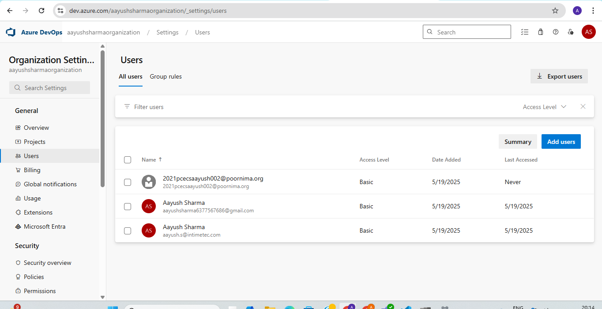
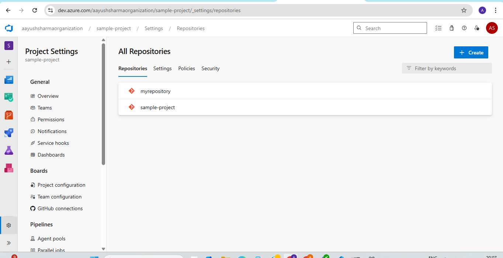
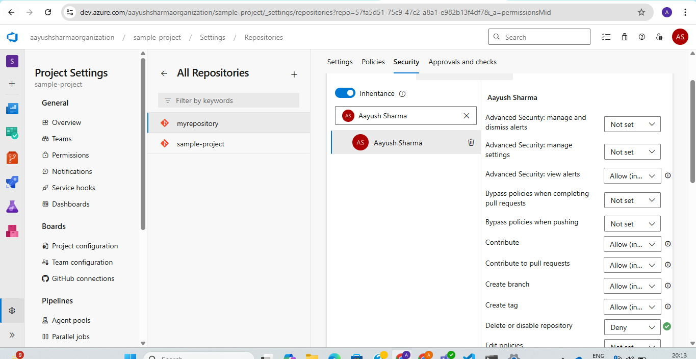

**Assignment: Add another member to the Azure Repos, ensuring they have appropriate access for repository management.**

1. Create a user:

Step 1: Go to organization settings and click on user and add user to particular project.

2. Assign access to repo:

Step 1: Select the project and go to project settings

Step 2: Select repositories from left side bar.

Step 3: Select the required repo and click on security

Step 4: In search bar add email id of added user and assign repo related appropriate access:

