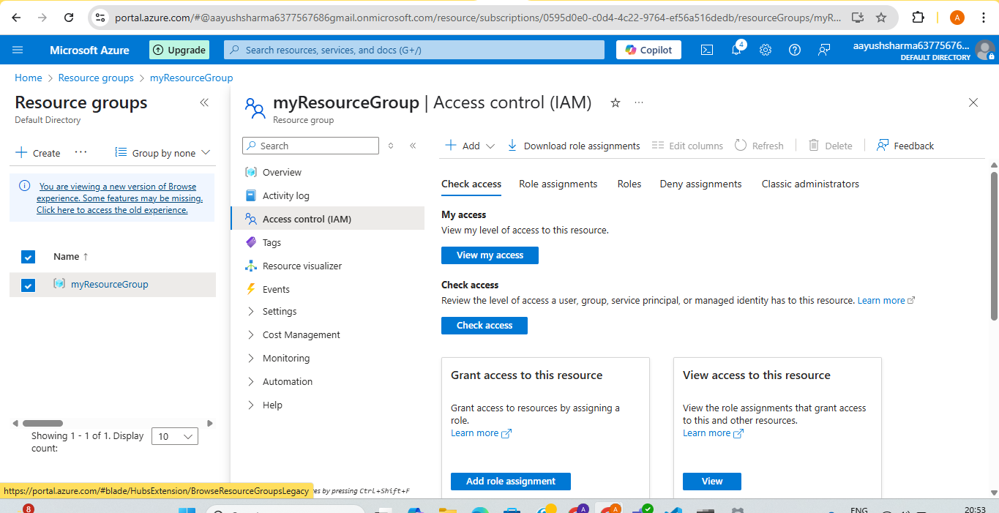
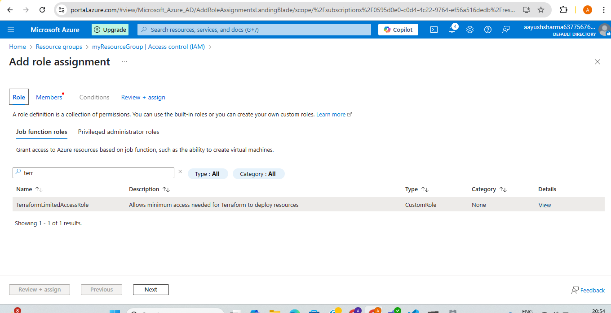
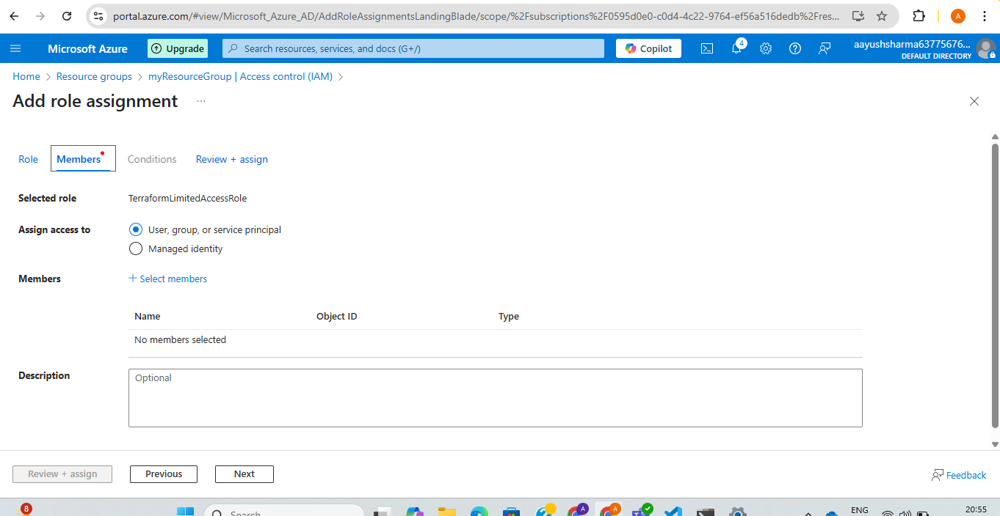

**Assignment: Use RBAC (Role-Based Access Control) to assign the minimum permissions required.**

Step 1: Go to azure portal and click on resource group created.

Step 2: In left side bar select Access control(IAM).

Step 3: Click on Add -> Add custom role and create JSON:

Step 4: Click on Add role assignment and search for created role:

Step 5: Click on next and add members and the role would be assigned to those members only.

