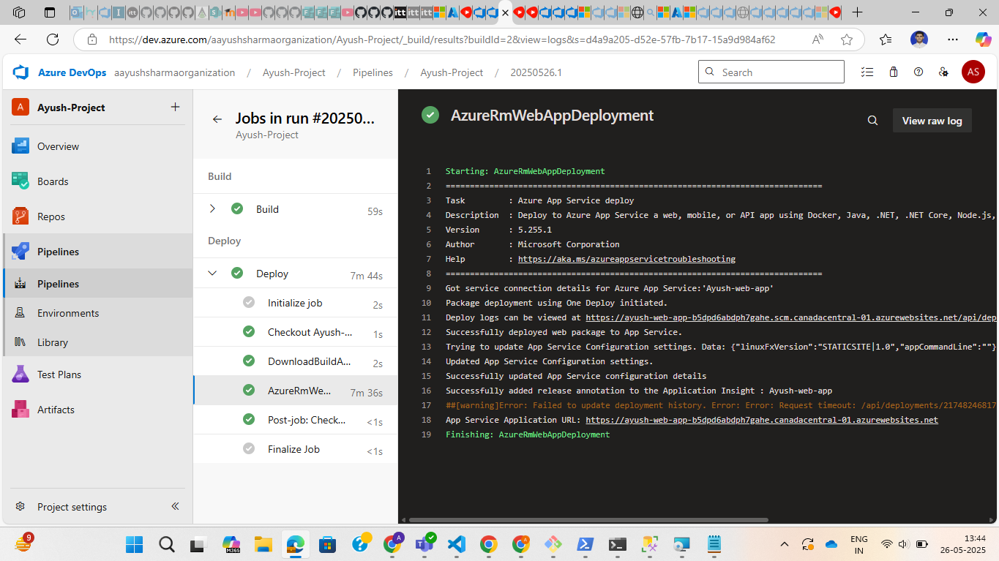
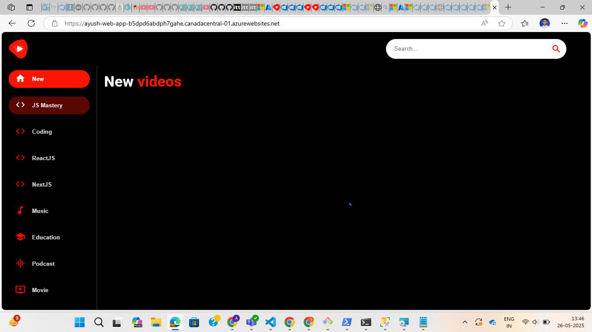

# Azure DevOps Pipeline with Manual Approval and Deployment to Azure Web App

## Step 1: Push Your Project to Azure Repos

Ensure your sample application (e.g., a Node.js app) is committed and pushed to your Azure Repos Git repository.


## Step 2: Create a Web App on Azure

1. Go to the Azure Portal.
2. Navigate to App Services.
3. Click "Create" and set up your Web App (select Node.js as the runtime stack).
4. Note down the App Service name and URL – you’ll use this in the pipeline.


## Step 3: Build and Deploy Pipeline with Manual Approval

### 1. Create an Environment in Azure DevOps

- Go to Pipelines > Environments.
- Click "New Environment".
- Name it (e.g., `dev-environment`) and add Approvers (email addresses).

### 2. YAML Pipeline (Example for Node.js App)

Create a file named `.azure-pipelines.yml` in your repo:

```yaml
trigger: 
- main

stages:
- stage: Build
  jobs:
  - job: Build
    pool:
      vmImage: 'ubuntu-latest'
    steps:
    - task: Npm@1
      inputs:
        command: 'install'
    - task: Npm@1
      inputs:
        command: 'custom'
        customCommand: 'run build'

    
    - task: PublishBuildArtifacts@1
      inputs:
        PathtoPublish: 'build'
        ArtifactName: 'drop'
        publishLocation: 'Container'

- stage: Deploy 
  jobs:
  - job: Deploy
    pool:
      vmImage: 'ubuntu-latest'
    steps:
    - task: DownloadBuildArtifacts@1
      inputs:
        buildType: 'current'
        downloadType: 'single'
        artifactName: 'drop'
        downloadPath: '$(System.ArtifactsDirectory)'
    - task: AzureRmWebAppDeployment@5
      inputs:
        ConnectionType: 'AzureRM'
        azureSubscription: 'Azure subscription 1(0595d0e0-c0d4-4c22-9764-ef56a516dedb)'
        appType: 'webAppLinux'
        WebAppName: 'Ayush-web-app'
        packageForLinux: '$(System.ArtifactsDirectory)/drop'
        RuntimeStack: 'STATICSITE|1.0'


```
### 3 After Running the Pipeline
-Approval Workflow
Once the Build stage is completed, the pipeline will pause at the deployment stage.

-It will wait for manual approval from the approver(s) you set in the environment.

-Approvers will get an email notification to approve the deployment.

### 4 Deployment
After approval, the deployment stage will start automatically.

Your application will be deployed to the Azure Web App created earlier.



### 5 View the Application
Navigate to the App Service URL (e.g., https://ayush-web-app-b5dpd6abdph7gahe.canadacentral-01.azurewebsites.net/

You should see your deployed Node.js application live.



