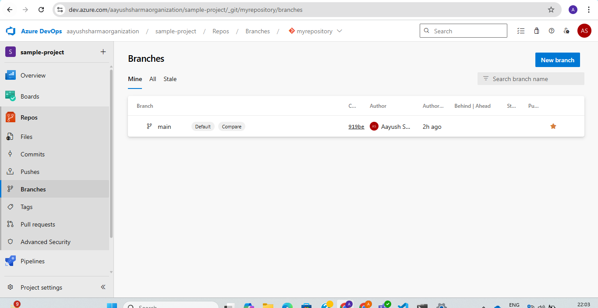
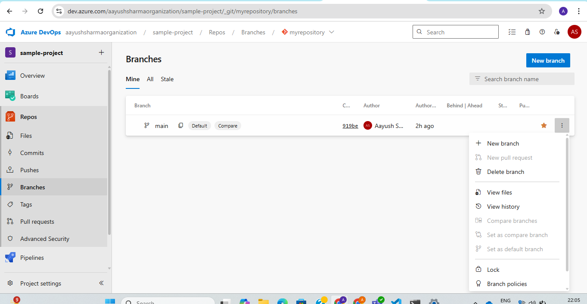
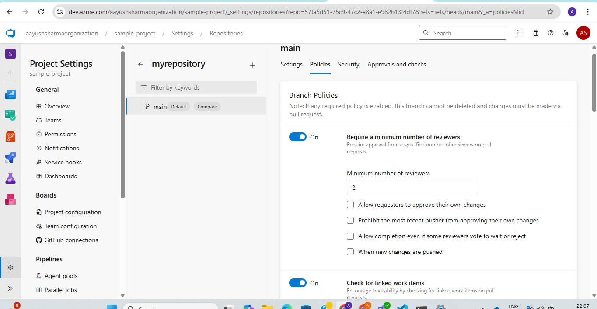
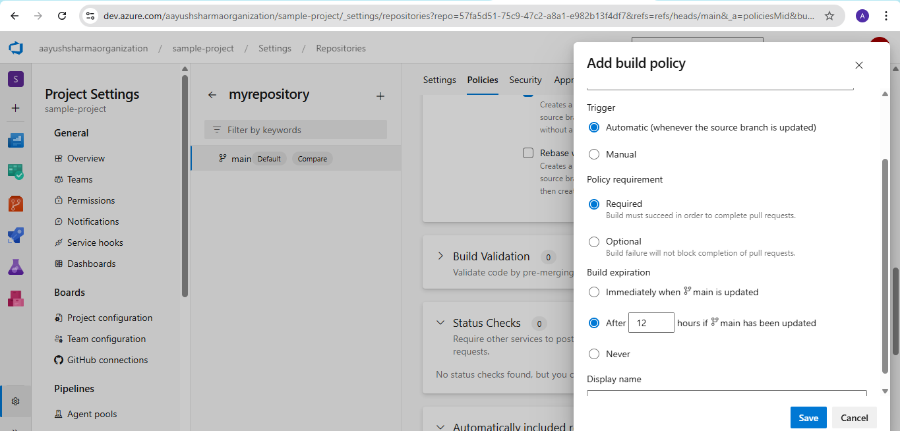

**Assignment 2: Implement Branch & Build Policies to ensure PR validation before merging.**

- Open your project

- Select repos from side bar and click on branch you want to select.

- Click on 3 dots on side of branch and select branch policies

- Update the branch and build polies like this:

What does this do ?

Pull Request (PR) Flow:
New PR is Raised (to main branch):

Your build pipeline (sample-project) will automatically trigger.

The pipeline will try to install dependencies, build, and zip your React app.

Build Validation:

Because you set the policy as Required, the PR cannot be completed unless the build succeeds.

This ensures your code compiles and passes build steps before merging to master.

Post-Merge:

Once the PR is approved (2 reviewers), linked to a work item, and the build passes:

The PR is merged into master.

Depending on how your pipeline is configured (trigger: [main] or CI trigger), the build will run again on the updated master branch to confirm stability.

Minimum reviewers = 2

Build must succeed (Required)

Work item linking is mandatory

Merge types restricted to keep commit history clean

Comment resolution is enforced

Build expiration after 12 hours ensures up-to-date validation