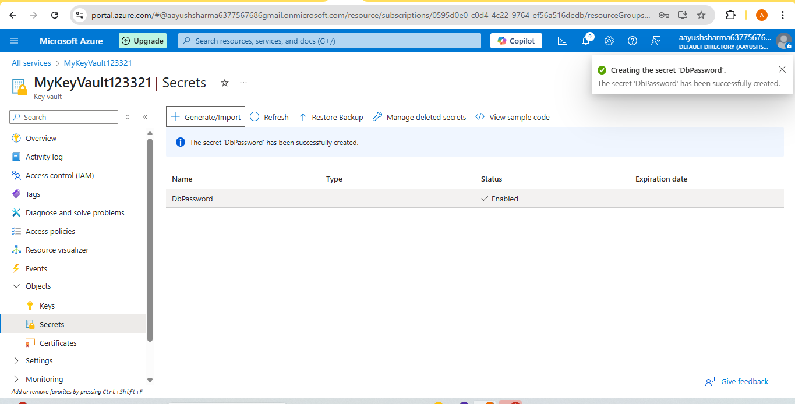

 #  Assignment 3: Configure Secrets Management using Azure Key Vault.


##  Step 1: Create a Resource Group

1. Go to Azure Portal → Search for **“Resource groups”**
2. Click  **Create**
3. Enter:
   - **Resource group name**: `MyResourceGroup`
   - **Region**: e.g., `East US`
4. Click **Review + Create** → **Create**

---

## Step 2: Create a Key Vault

1. In Portal → Search for **“Key Vaults”**
2. Click **Create**
3. Fill in:
   - **Key vault name**: `MyKeyVault123` (must be globally unique)
   - **Region**: Same as your resource group
   - **Access Configuration**: Leave as default (**RBAC**) 
4. Click **Review + Create** → **Create**

---


## Step 3: Assign Yourself RBAC Permissions

1. Go to your **Key Vault** → **Access control (IAM)**
2. Click **Add → Add role assignment**
3. Choose role:
   - **Key Vault Secrets Officer** (can manage secrets)
4. Assign to:
   - Your Azure user account (search and select)
5. Click **Next** → **Review + Assign**
6. Wait 1–2 minutes for the role to apply

---

## Step 4: Create a Secret in Key Vault

1. Go to **Key Vault** → **Secrets**
2. Click **Generate/Import**
3. Enter:
   - **Name**: `DbPassword`
   - **Value**: `MySecureP@ssword123`
4. Click **Create**

---



## Step 5: View or Retrieve the Secret

1. In **Key Vault → Secrets**, click `DbPassword`
2. Click on the latest version
3. Click **“Show secret value”**

You should now see your secret value.

---


## We can also use Azure CLI to Set or Get Secrets

### Set a Secret:
```bash
az keyvault secret set --vault-name MyKeyVault123 --name "DbPassword" --value "MySecureP@ssword123"
