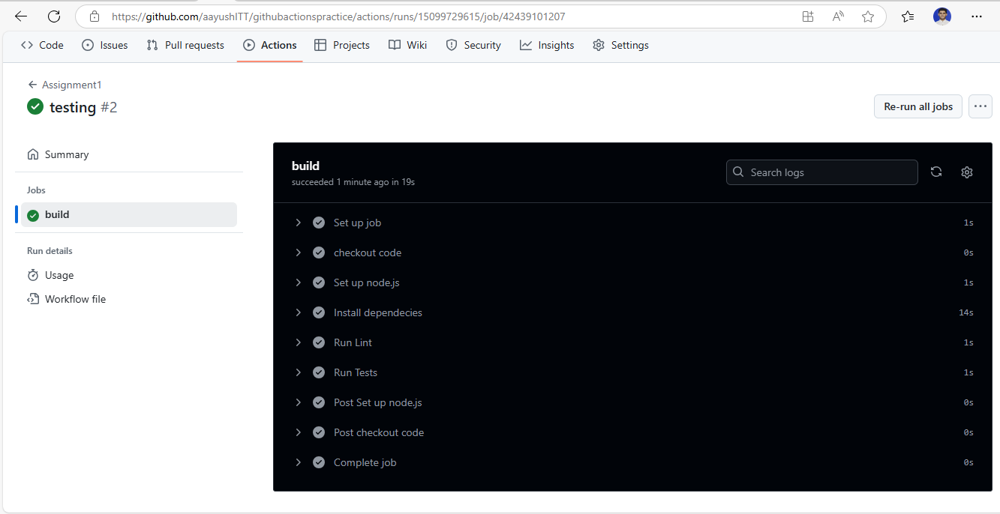

**Assignment: Set up a GitHub Actions Workflow that triggers on code push and runs unit tests & lining.**

The folder structure would be :

your-project/
├── .github/
│   └── workflows/
│       └── ci.yml              # GitHub Actions CI pipeline
├── math.js                     # Code file with logic
├── math.test.js                # Test file for unit tests
├── package.json                # Project config with scripts
└── .eslintrc.json              # ESLint config

After pushing the code to github the workflow gets triggered and runs the pipeline.

