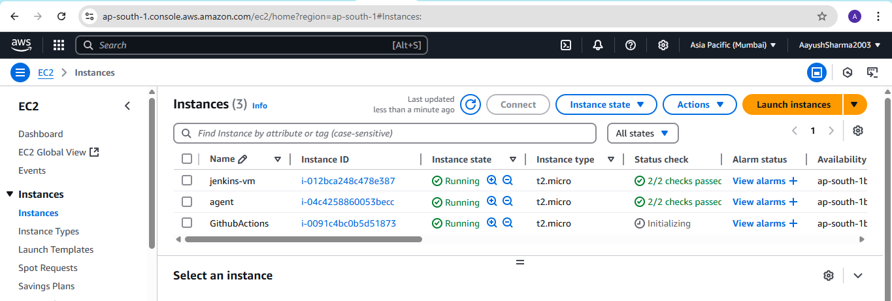
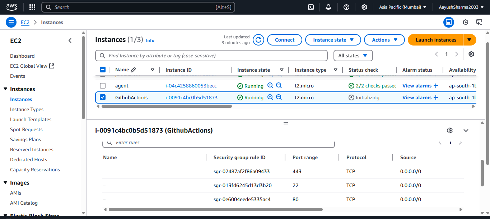
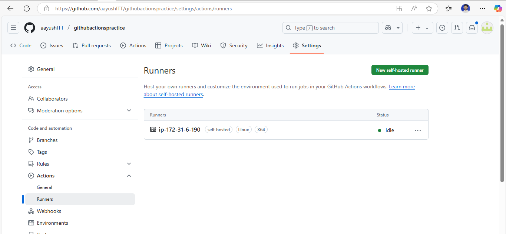
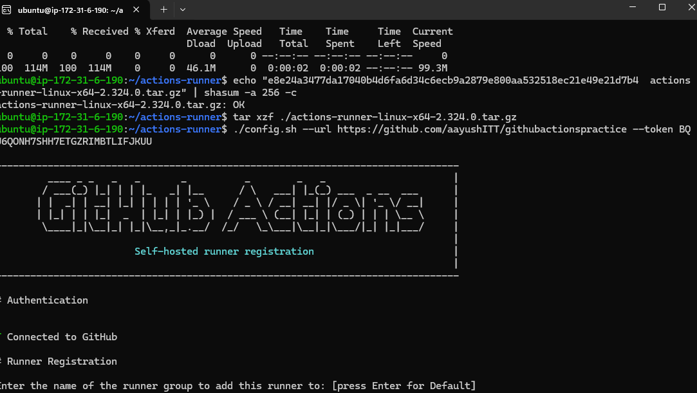
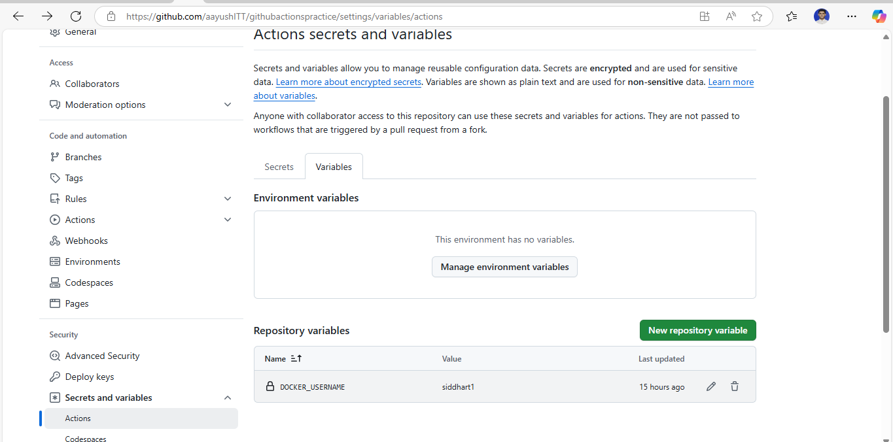
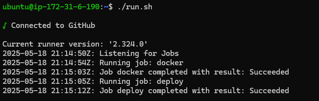
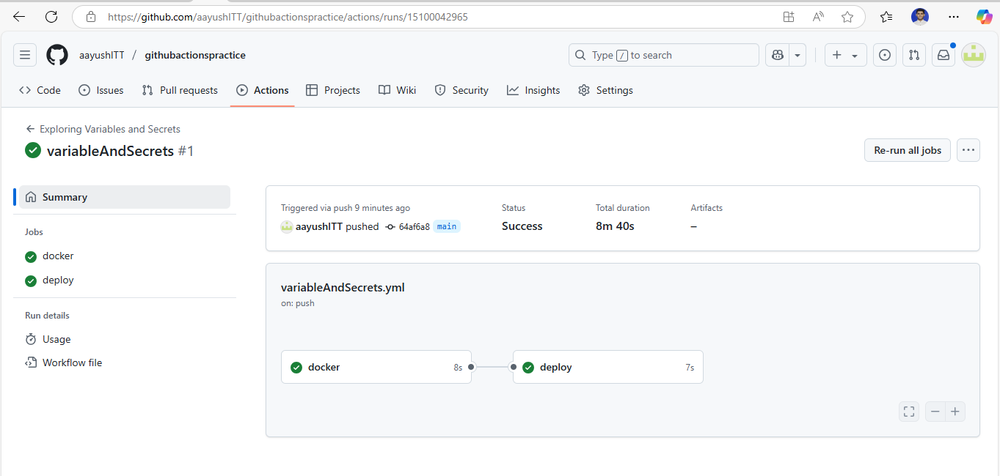

**Assignment : Use self-hosted runners and configure environment variables & secrets.**

1. Create a self hosted runner.

Step 1: Create an ec2 instance in aws of linux operating system.

Step 2: Set http and https from anywhere ipv4 as inbound and outbound rules.

2. Integrate github actions self hosted runner to this ec2 machine.

Step 1: Select settings of repository and choose Actions and runners.

Step 2: Add new self hosted runner and choose os as linux and run the following commands on linux virtual machine.

3. Add secrets and variables.

Step 1. Go to repository settings and choose secret and variables and add secret and variable.

Step 2: Create a pipeline same as variableAndSecrets.yaml where secret and variable are called.

Step 3: In pipeline stages choose runs-on as self-hosted.

Step 4: Push the pipeline to github and check both ec2 machine and github actions.

