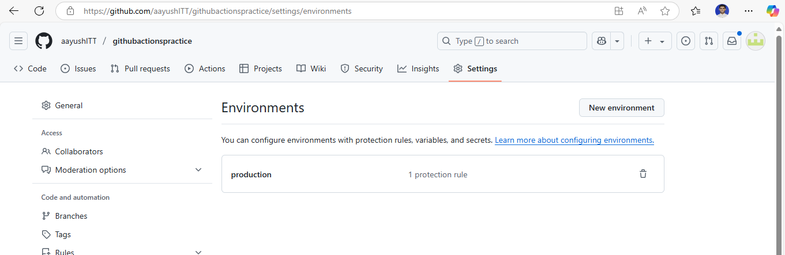
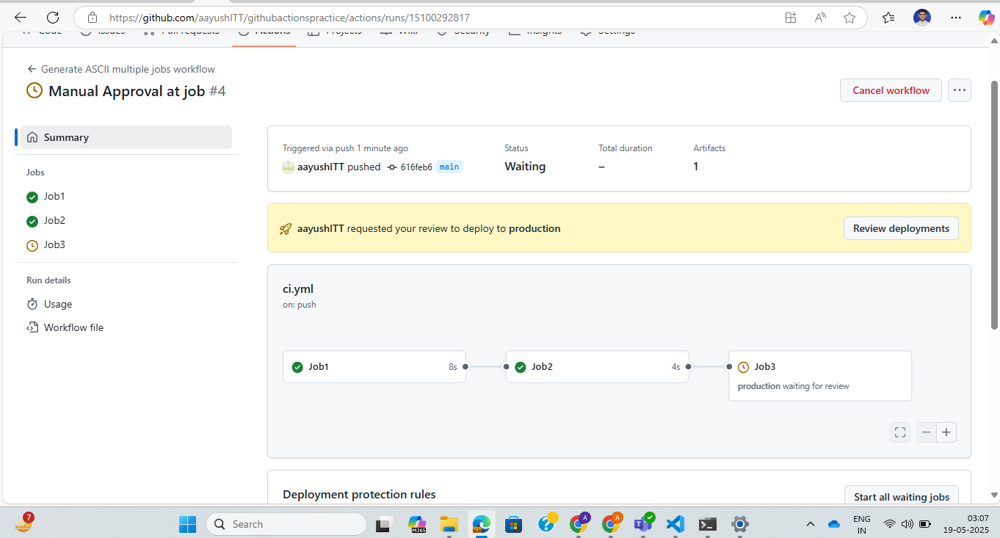
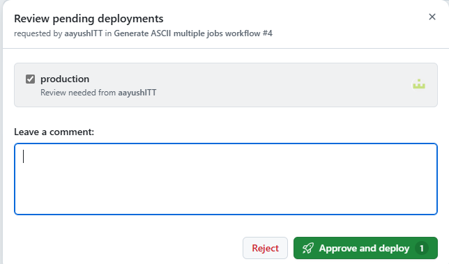
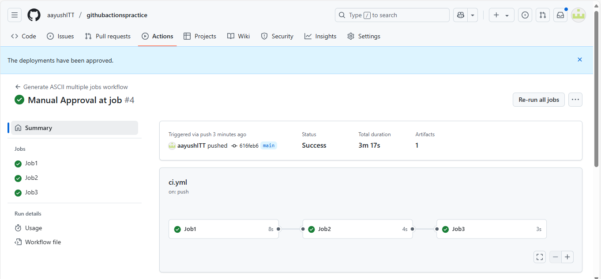

**Assignment: Add a manual approval step before deploying to production.**

1. Create an environment inside github repo > settings > environment: 

2. Add required reviewers

3. Now push the code to github and watch github actions:

4. It will ask fro approval

5. After approval all stages get completed.

