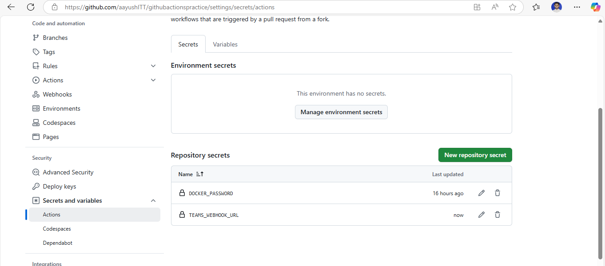
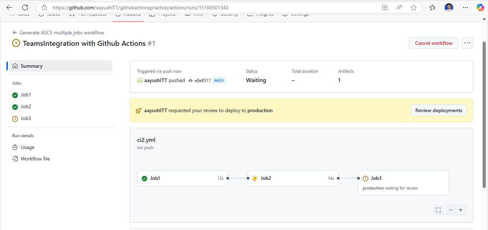
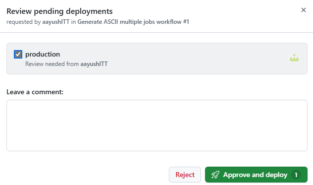
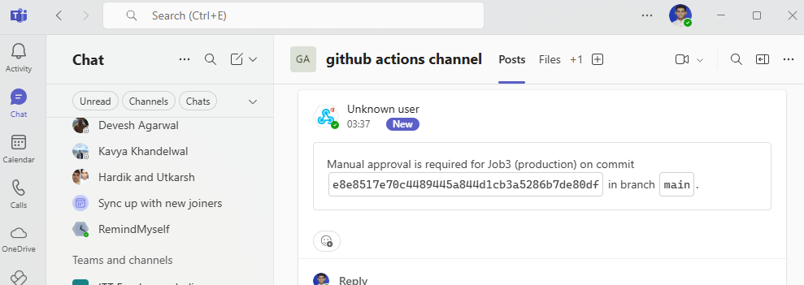

**Assignment: Integrate with Slack or Teams for build notifications.**

Integrating Microsoft Teams with github actions for build notification.

1. Connect teams with github.

Step 1: In the New Teams client, select Teams  and navigate to the channel where you want to add an Incoming Webhook.

Step 2: Select More options ••• on the right side of the channel name.

Step 3: Select Manage channel.

Step 4: Select Edit.

Step 5: Search for Incoming Webhook and select Add.

Step 6: Select Add.

Step 7: Provide a name for the webhook and upload an image if necessary.

Step 8: Select Create.

Step 9: Copy and save the unique webhook URL present in the dialog. The URL maps to the channel and you can use it to send information to Teams.

Step 10: Select Done. The webhook is now available in the Teams channel.

2. Now in go to github repo > settings > secret and variables

3. Push the ci pipeline to github

4. See the teams channel and in github actions do the manual approval

5. Watch the teams channel and check message.

