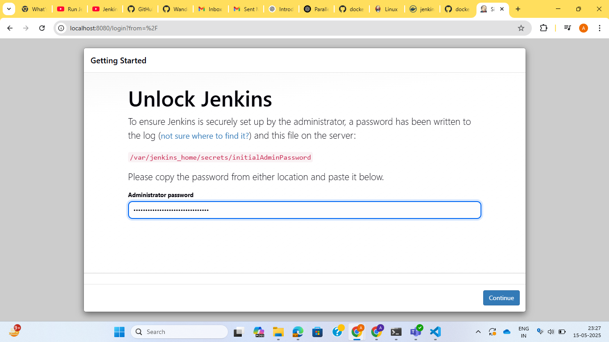

**Assignment: Create a dockerfile to run Jenkins in a container**

Run the following commands after creating a Dockerfile:

```docker build -t myjenkins .```

```docker run -d --name jenkins_container -p 8080:8080 -p 50000:50000 -v jenkins_home:/var/jenkins_home   -v /var/run/docker.sock:/var/run/docker.sock myjenkins```

Copy the administrator password by running command:

``` docker logs jenkins_container```

Now move to browser and follow the steps:

```Search for localhost:8080```

```Paste the password copied```

```Add name, new password, full name and email address.```

```download required dependencies.```


