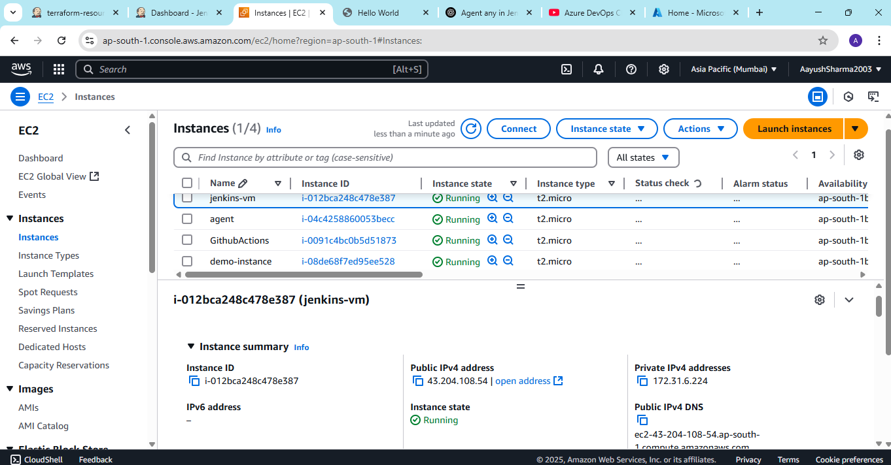

**Assignment: Create a freestyle job to deploy resources on AWS using terraform**

1. Install plugins : Terraform, AWS credentials

and access key and secret access key in jenkins manage > credetials > global section

2. Apply terraform installation from manage jenkins > tools

3. Add main.tf file to github repo

4. Create a freestyle job with configure:

**SCM as git with github url**

**Use aws secret credentials**

**Select terraform checkbox in environment section**

**Add build steps in build section**

5. See the output on aws console

