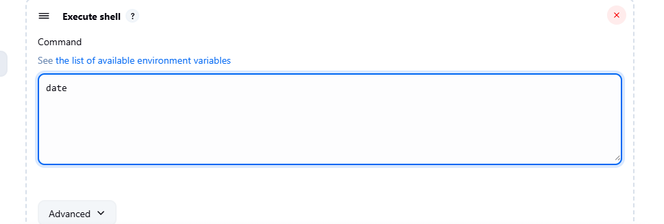
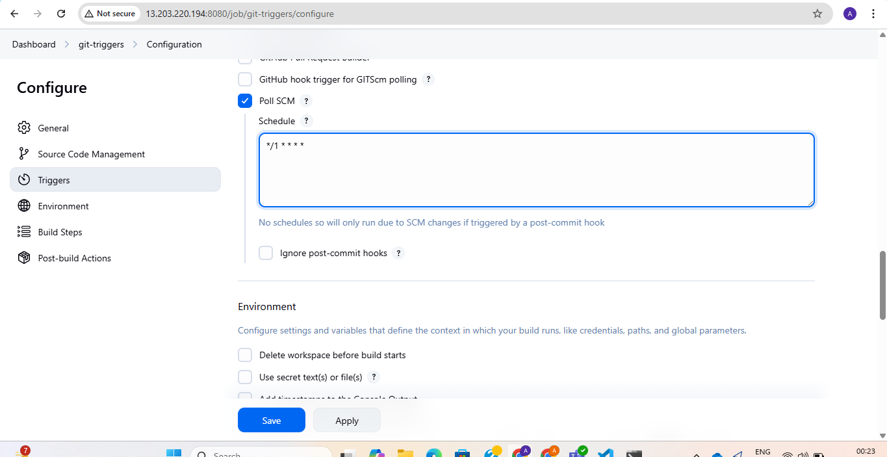
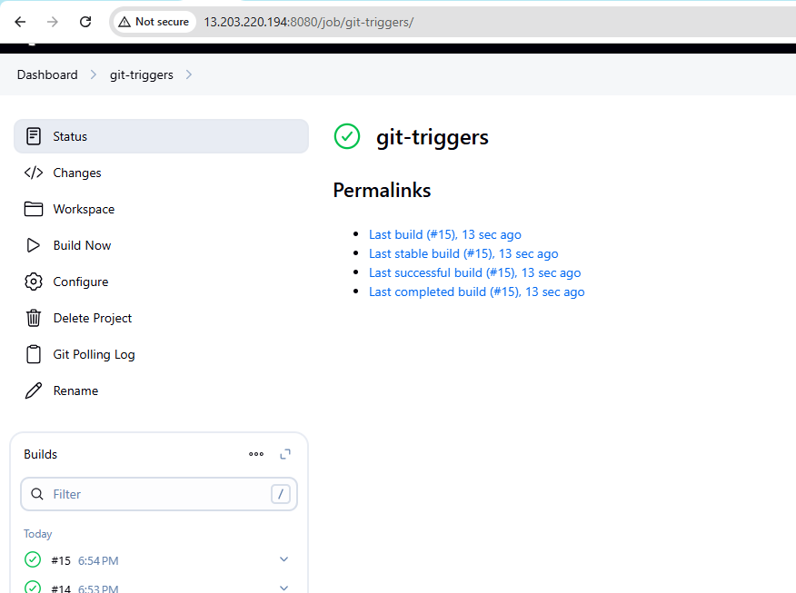

**Assignment: Create Webhook and different job triggers implementation.**

Copy any github repo url:

Create a freestyle Job with source code management as Git:

Different Job triggers:

1. Trigger builds remotely 

In this we can trigger the build of a job by hitting this URL on browser:
>> JENKINS_URL/job/triggers/build?token=TOKEN_NAME

Before hitting url number of builds are:

Hitting URL on browser:

Now the number of builds:

But there is one issue with this trigger. If we trigger this URL on incognito mode or curl this URL it will ask authentication and will not trigger the build.

To overcome this we can install a plugin : build authorization token root

Now we can run this URL on incognito and can curl also it will not ask for authenication:

>> buildByToken/buildWithParameters?job=RevolutionTest&token=TacoTuesday&Type=Mexican

Now if i hit this url on incognito then it will trigger the build:

One more build is triggered.

2. Build after other projects are buit

In this i create another item named demo-trigger.

Now in my triggers item only i added the configuration like this:

This means if demo-trigger get build with stable output then only build of this item get triggered.

Now demo-trigger item is build manually.

We can see triggers item also got triggered and build the item.

Other options are:

1. Trigger only if build is stable : Triggered on Build Status = SUCCESS and does not triggered on Build Status: UNSTABLE, FAILURE, ABORTED
2. Trigger even if the build is unstable : Triggered on Build Status = SUCCESS, UNSTABLE and does not triggered on Build Status: FAILURE, ABORTED
3. Trigger even if the build fails : Triggered on Build Status = SUCCESS, UNSTABLE, FAILURE and does not triggered on Build Status: ABORTED
4. Always trigger, even if the build is aborted : Triggered on Build Status = SUCCESS, UNSTABLE, FAILURE, ABORTED.

3. Build periodically

In this we have to add cronjob with specific schedule at which it should automatically build job again and again.

I have added cron job to trgger the build after every one minute.

In build step i have added shell command : date

Now we can see after every minute the build is triggered.

4. Poll SCM

In this also we add a cronjob to schedule to trigger the build but instead of triggering build according to schedule it just checks the code uploaded on github after the time it is scheduled and if it founds any different in the code it will trigger the build.

initially it triggers for one time:

Later on only it get triggered when i make any change to my code on github

