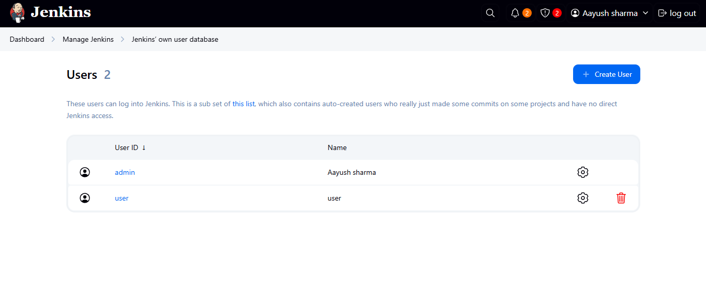
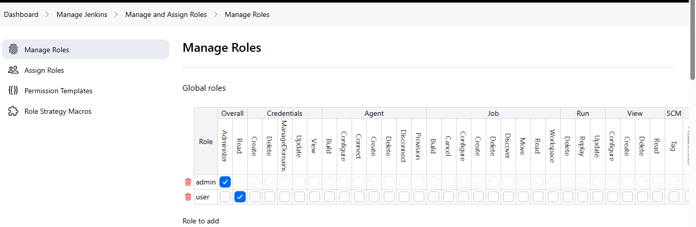
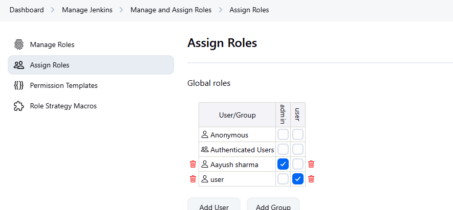
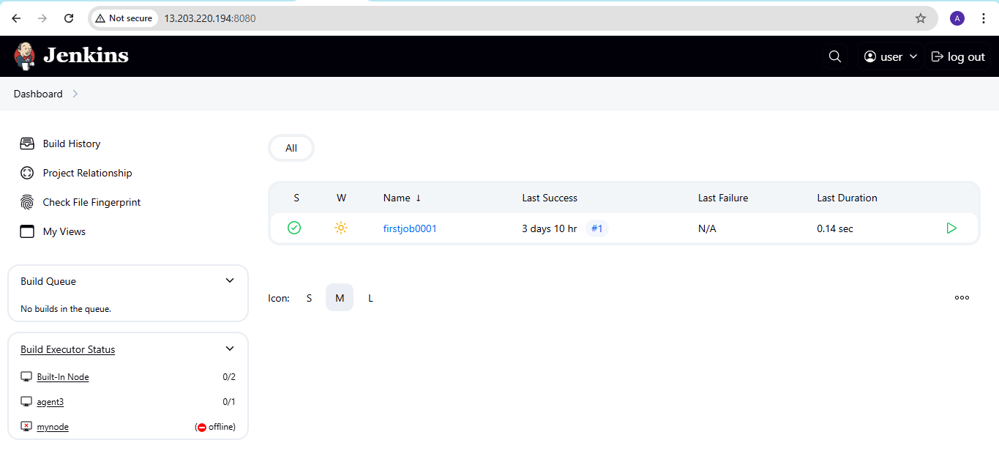
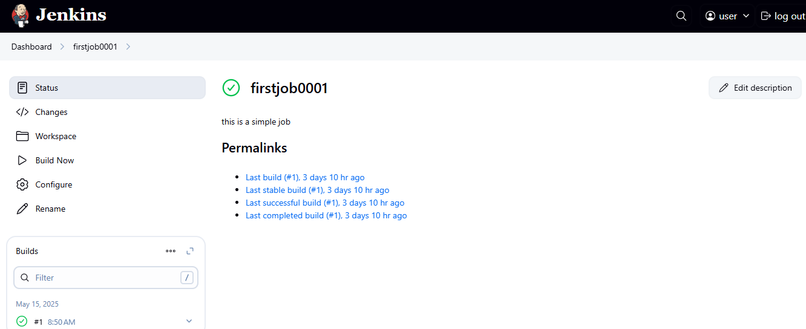
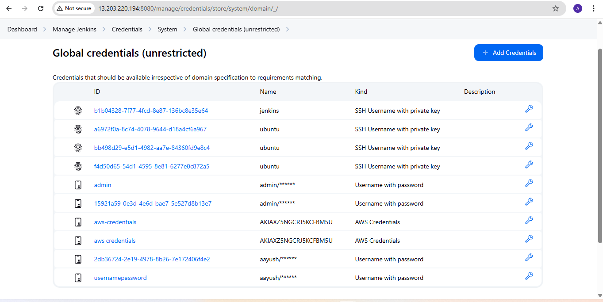
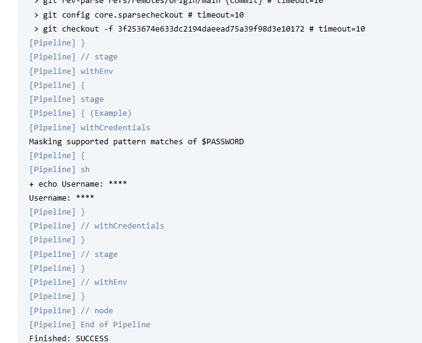

**Assignment: Implement RBAC to restrict access and store credentials securely.**

**RBAC to restrict access**

1. Create one more user name user:

2. Install the plugin named role based authorization strategy

3. Move to manage jenkins > security > authorization > role based strategy.
Click on apply and save.

4. Now select manage and assign roles section in manage jenkins

5. Create role that have only read access and name the role as viewer.

Click on apply and save.

6. Now select assign role from left sidebar and choose add user and assign the role created.

Now login with that user and check you can build any item or not

User can only read, he cannot build, configure or anything with the Job.

**Store credentials securely**

1. Move to jenkins manager > credentials > System > Global credentials and added a username and password credential

2. Create a pipeline job from Jenkinsfile and apply and save.

3. Build the pipeline and check the console output:

