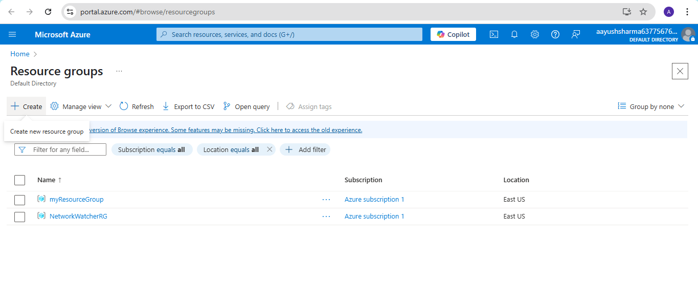
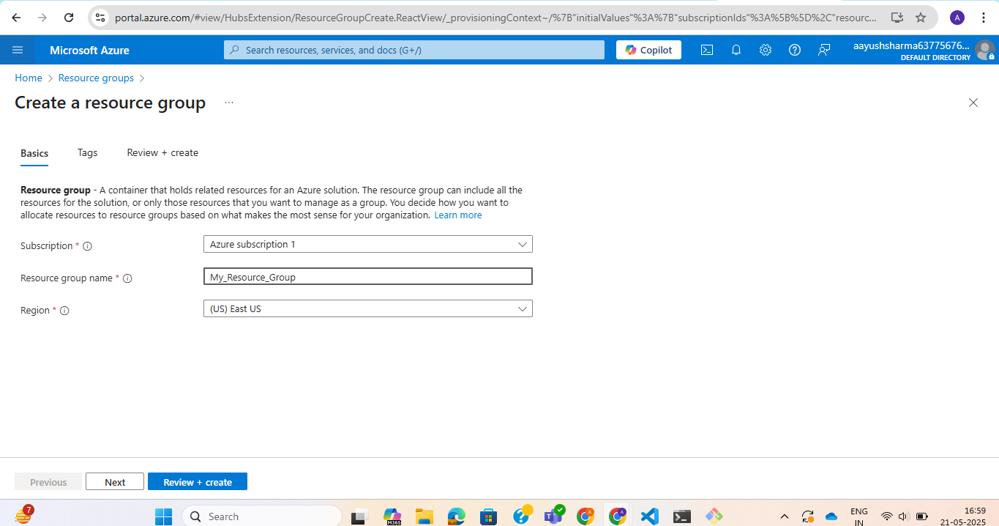
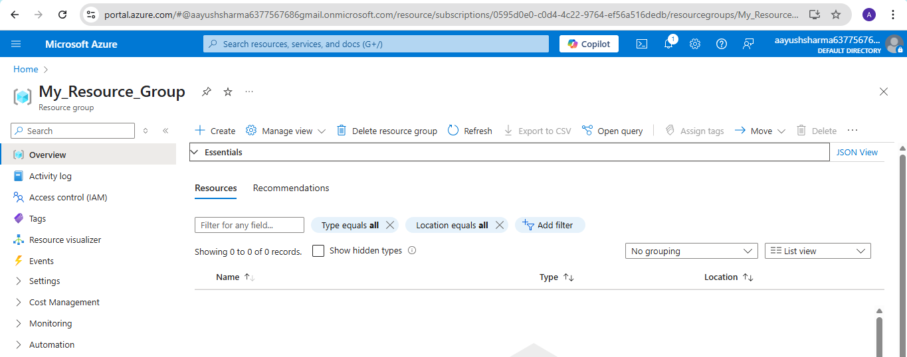
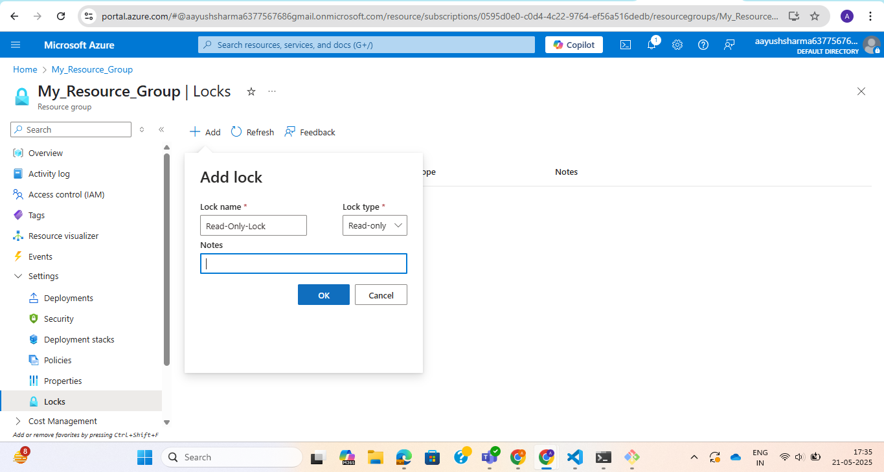
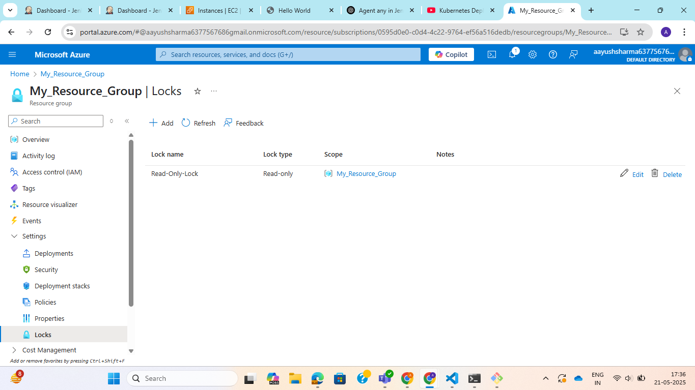
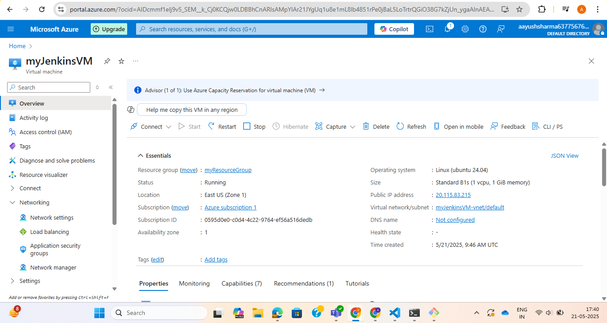
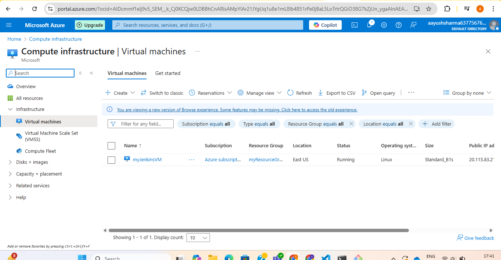
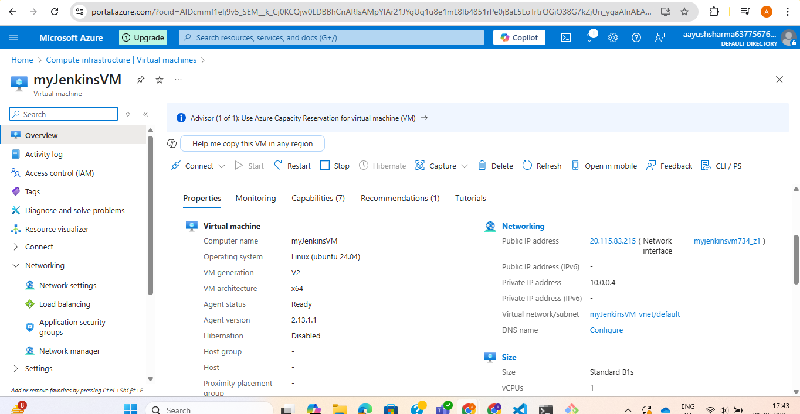
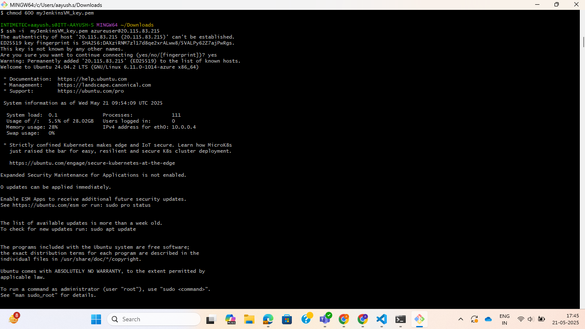
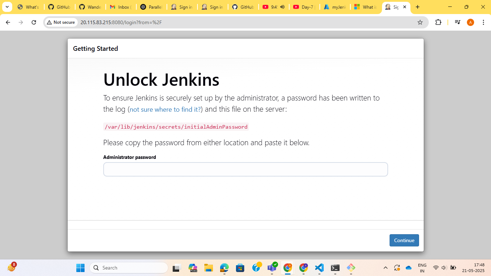

**Assignment 1: Create a Resource Group and apply a lock (Read-Only or Delete) using the Azure Portal.**

Step 1: Go to Azure Portal.

Step 2: Navigate to search bar and type resource group.

Step 3: Click on create new resource group.

Step 4: Select subscription and add name to resource group.

Step 5: Click in review and create.

Resource group will be created.

Step 6: Select the resource group created and click on settings > Locks

Step 7: Click on Add lock and add name to the lock and lock type : read only

**Assignment 2: Deploy an Azure Virtual Machine (Linux/Windows) via the Portal and explore:Network configuration, Disk types, VM size options**

Step 1: Go to Azure portal and navigate to search bar and search Virtual machine.

Step 2: Click on create vitrual machine.

Step 3: Add details in the basic section, disks, networking and click on review and create.

Step 4: Once after clicking on create it will prompt for downloading private key.

We can see our virtual machine has been created.

Now to access the virtual machine:

Step 1: Select virtual machine created and click on connect.

Step 2: Select native ssh for connection.

Step 3: Copy the ssh command:

ssh -i ~/.ssh/id_rsa.pem azureuser@4.213.225.91

Step 4: Open Powershell and paste the command with appropriate path to private key.

