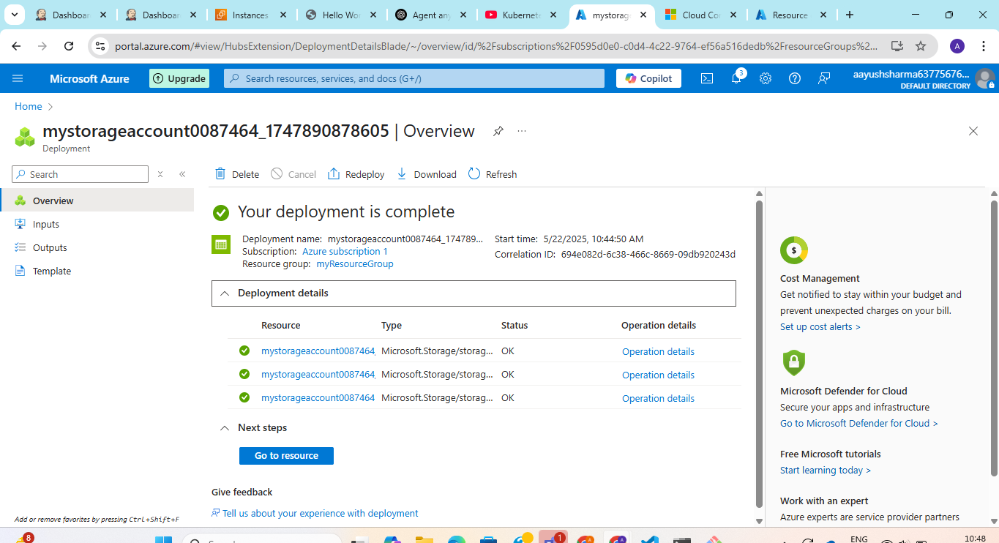
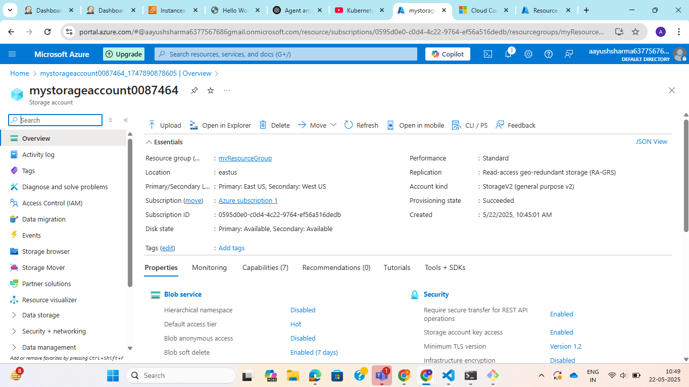
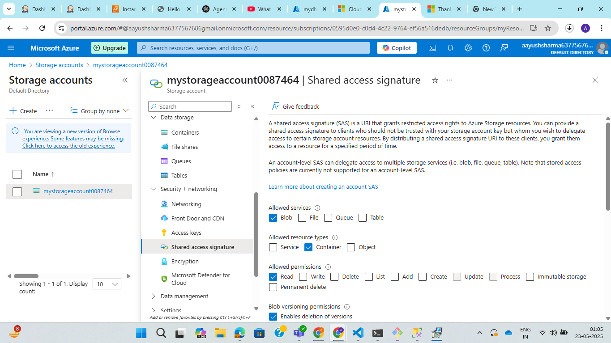
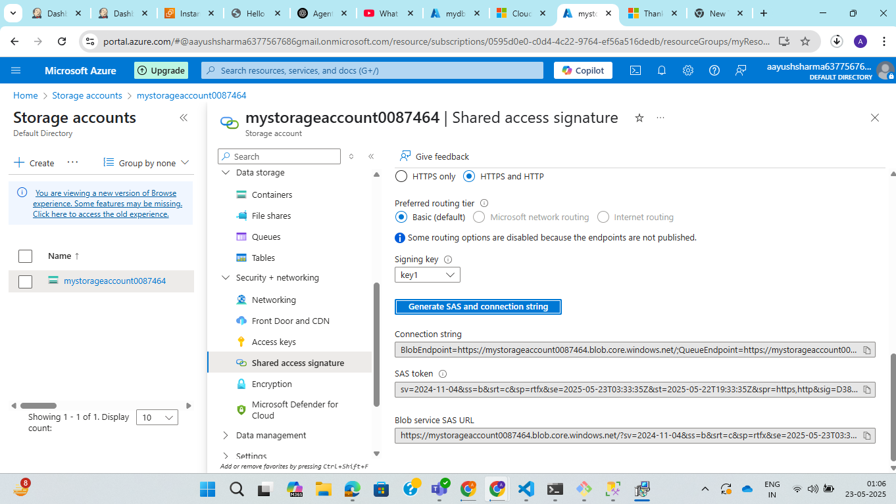
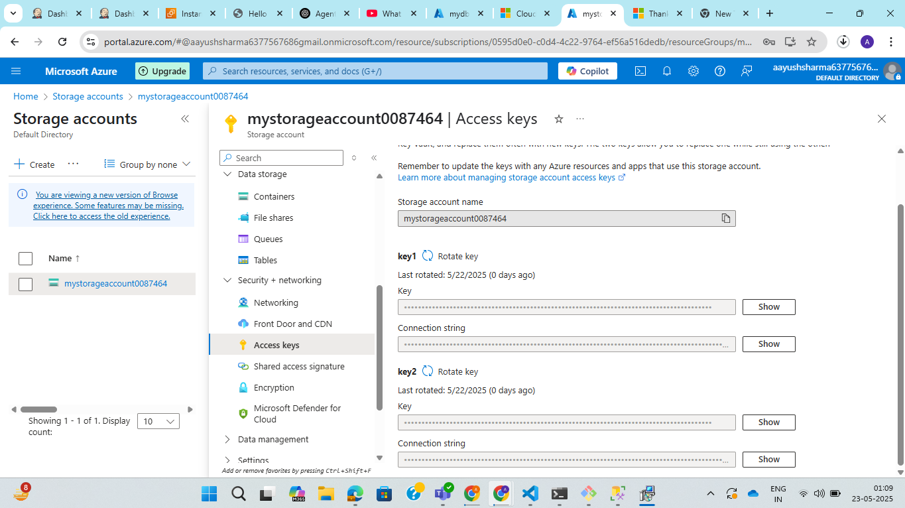
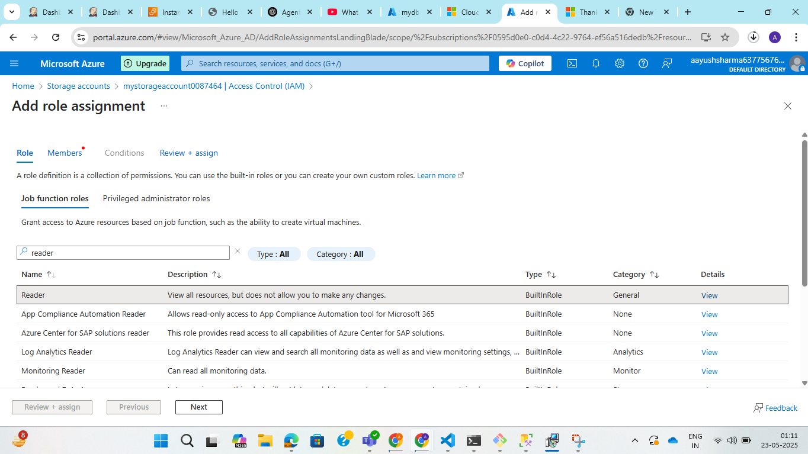
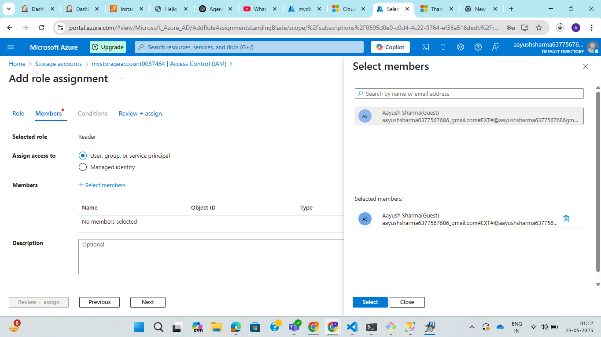

**Assignment: Create an Azure Storage Account and explore: Blob, File, Queue, Table storage and Authentication & Access Control (SAS, Access Keys, RBAC)**

1. Create Azure Storage account:

Step 1: Go to azure portal and search for Storage account in search bar.

Step 2: Click on create storage account button.

Step 3: Enter the basic details like subscription, resource group, name, region, service, performance and redundancy.

Step 4: Click on review and then create.

2. Shared Access Signature token for accessing blob storage

Step 1: Select the storage and click on security and networking > SAS on left side bar menu. 

Step 2: Configure SAS token:

Step 3: Click on generate SAS and connection string.

You can copy this URL and share it or use it to access the blob or container.

3. Access keys

Step 1: Select the storage account and click on security and networking > access keys on left side bar menu.

Azure provides two access keys (Key1 and Key2) for each storage account. This allows you to rotate keys (change them) without downtime. You can regenerate one key while using the other, ensuring continuity of access.

Access Keys provides full, unrestricted access to an entire Azure Storage Account. They are suitable for situations where you need complete control over storage resources, but they must be securely stored and rotated periodically.

4. RBAC

Step 1: Select the storage account and click on Access policy(IAM) on left side bar menu.

Step 2: Click on add > add role assignment and select role (Reader).

Step 3: Assign role to the members.

