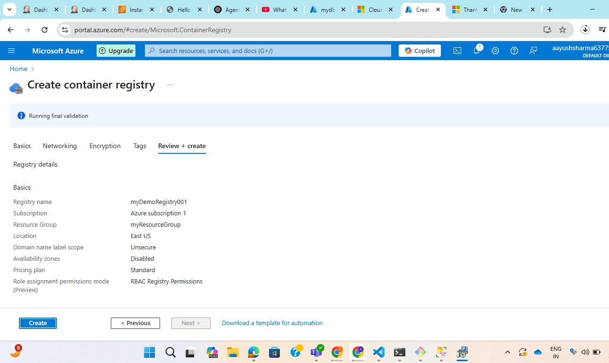
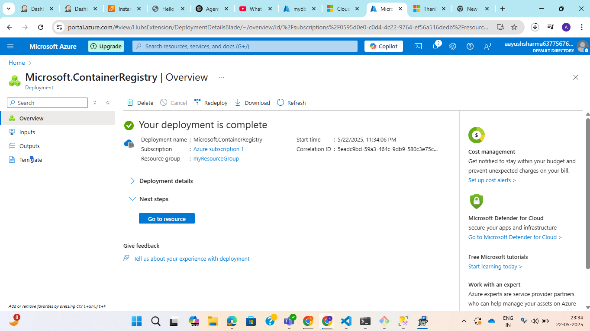
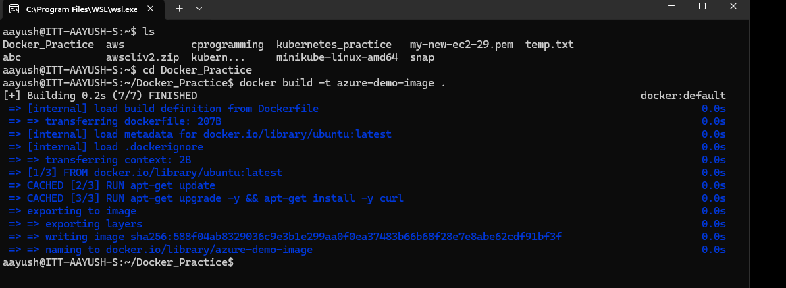
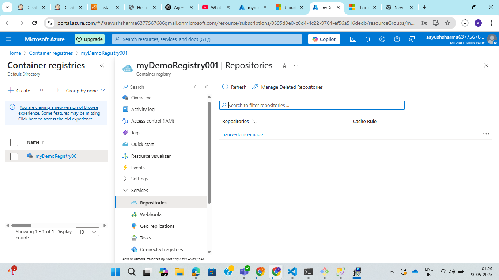
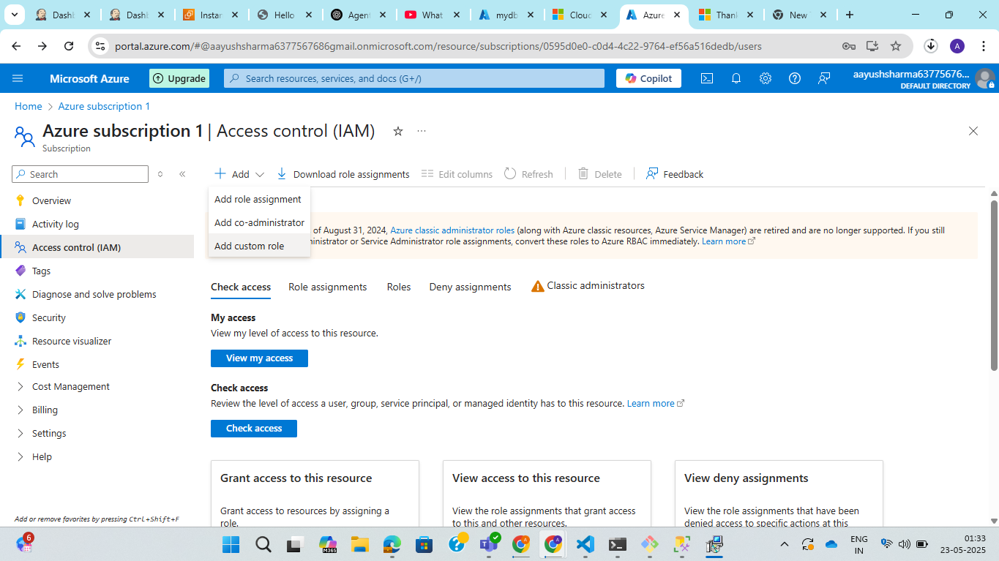
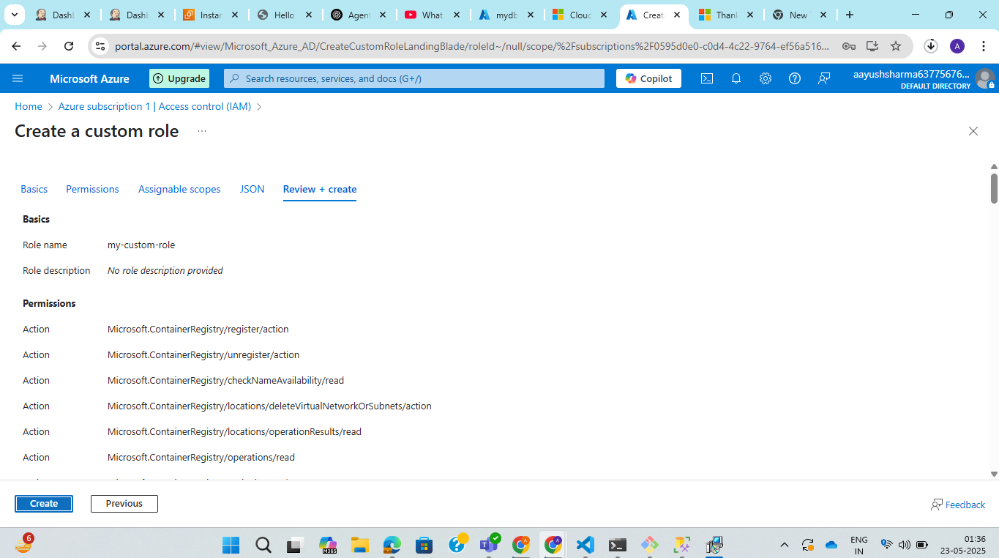
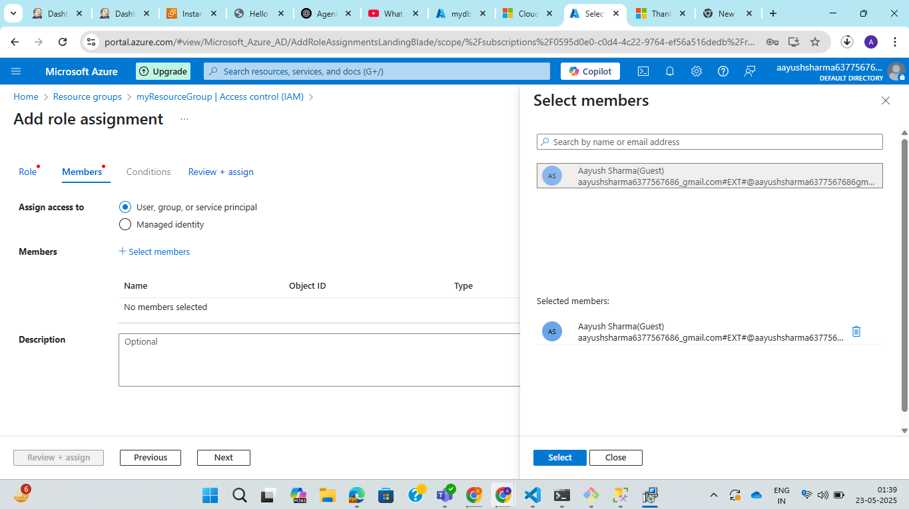

**Assignment: Create an Azure Container Registry (ACR) and a Custom IAM Role that provides access to manage ACRs in a Resource Group.**

Azure container registry
Step 1: Go toazure portal and search for container registry in search bar.

Step 2: Click on create button and add basic details like subscription, resource group, registry name, location etc.

Step 3: Click on review and create.

Step 4: From local push the image to azure containaer registry.

**Custom IAM role : Give users ability to manage ACRs within a specific resource group only**

Step 1: Go to subscription and select your subscription.

Step 2: Select Access control (IAM) from left side bar menu and click on add custom role.

Step 3: Create custom role and add resource group in assignable scopes.

Step 4: Go to resource group created and click on Access control (IAM).

Step 5: Click on add role assignment and select the role created : ACR Manager.

Step 6: Add member to the role and assign to the resource group.