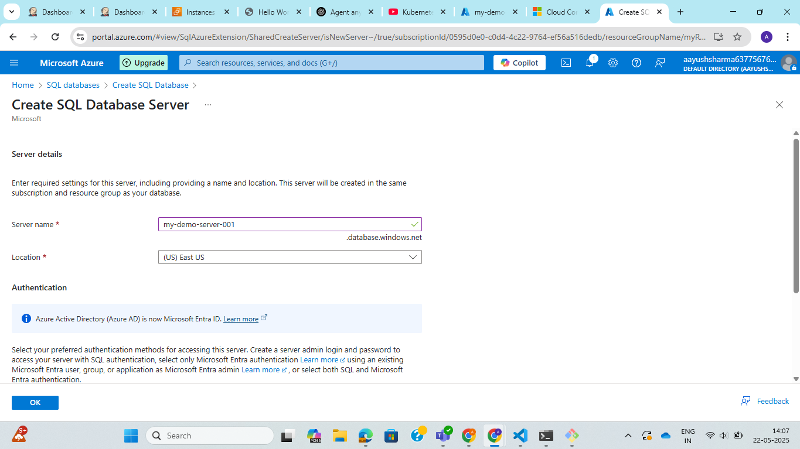
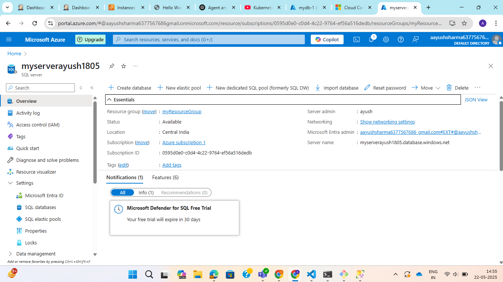
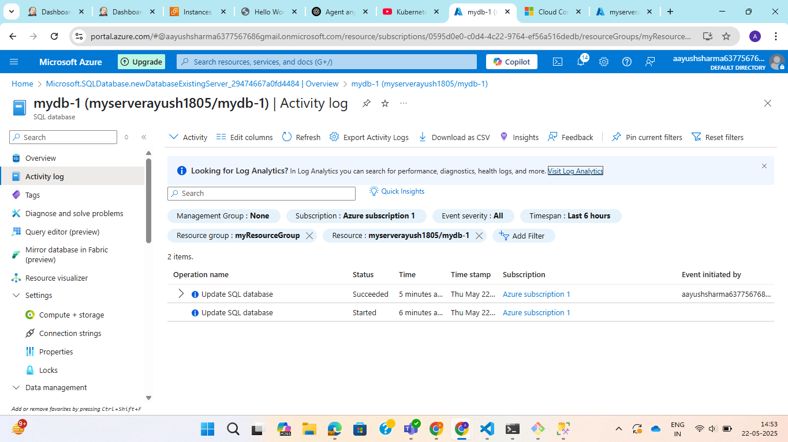

**Assignment : Create an Azure SQL Server and Database and configure Azure AD authentication.**

#### Create Azure SQL server and database.

Step 1: Go to azure portal and search for SQL database service.

Step 2: Click on create database and enter subscription, resource group, db name, server, storage,

Step 3: Click in create new server and fill the details like server name, location, authentication method, admin login and password.

Server:

Database:

