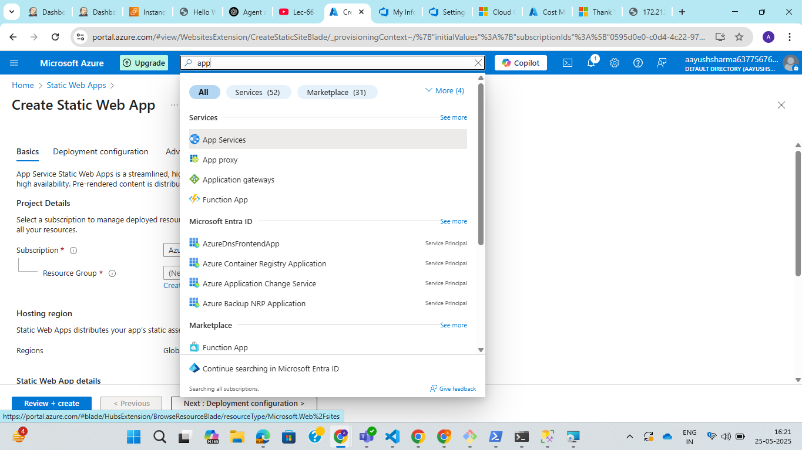
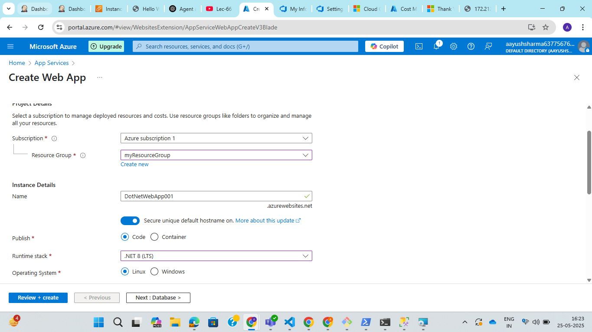
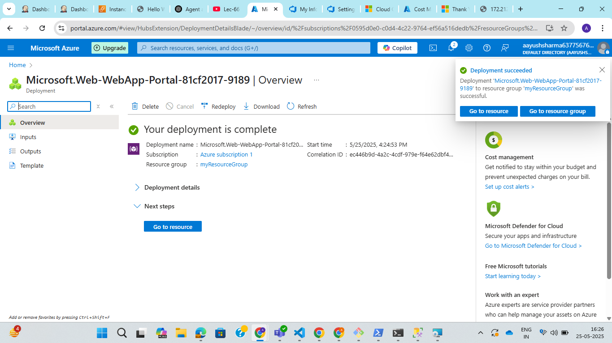
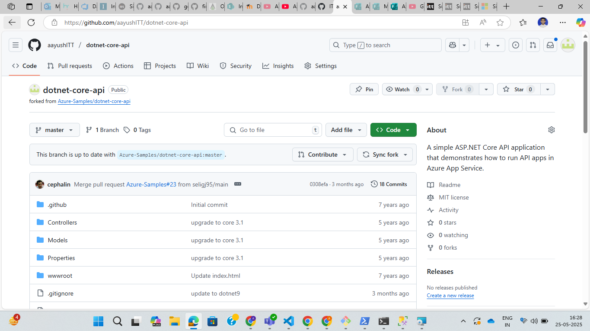
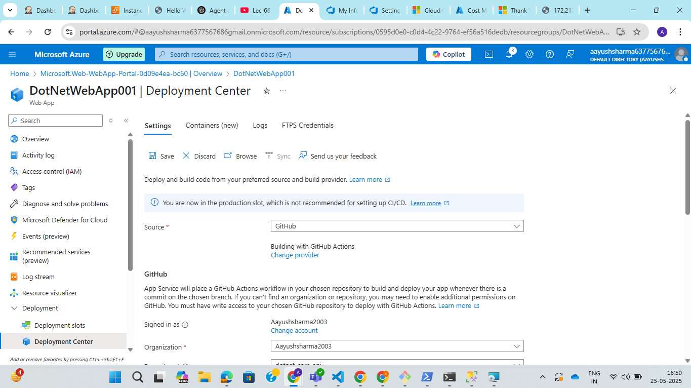
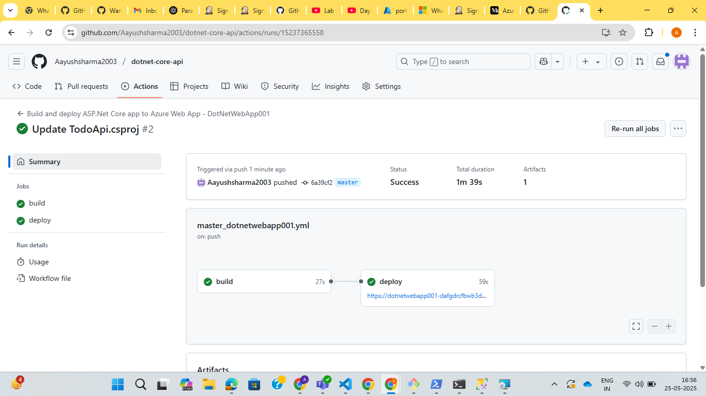
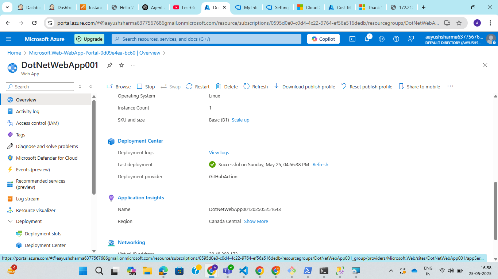
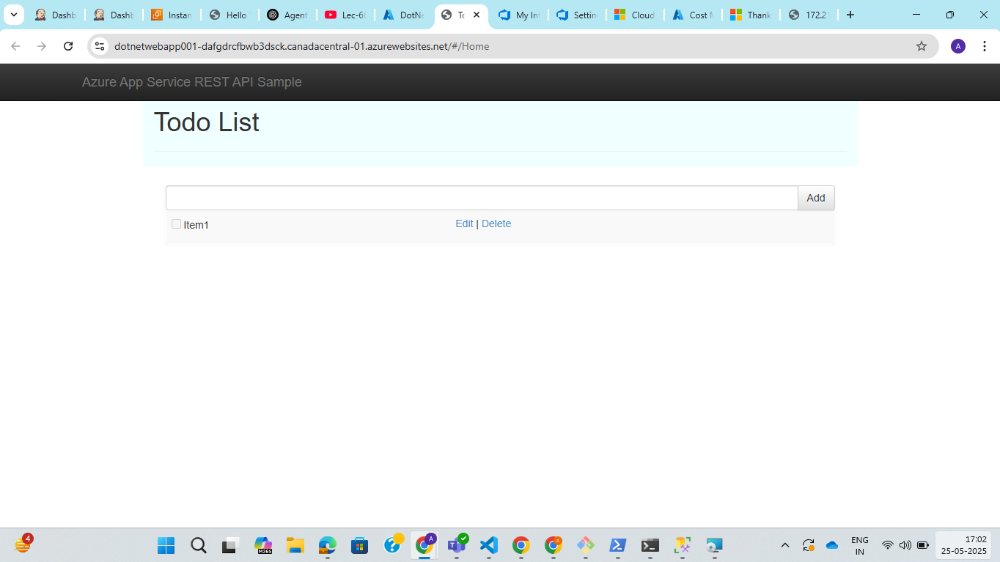

**Assignment: Deploy a .NET sample application to an Azure Web App Service.**

1. Create Azure App Service

Step 1: Go to azure portal and search for app service.

Step 2: Click on create web app service and fill the basic detials:

Step 3: Click on review and create the app service.

2. Sample .Net application

Step 1: Fork random .Net sample application

3. Deploy .Net application to app service.

Step 1: Select the app service.

Step 2: Click on left side bar menu and select Deployment > Deployment Center and fill the detials.

Step 3: Check the github action. Pipeline triggered successfully.

