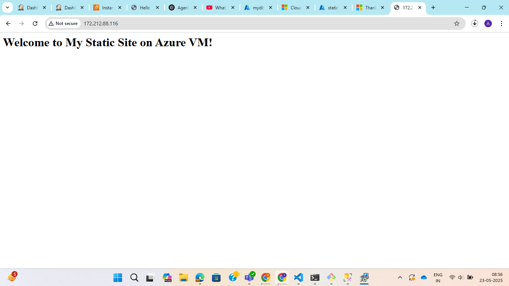

**Assignment: Create a Linux VM with a pre-hosted static webpage and capture a VM Image.**

#### Create a virtual machine
Step 1: Go to Azure portal and select virtual machine service.

Step 2: Click on create virtual machine and fill the basic detials.

Step 3: Click on create and review.

Step 4: SSH into it

Step 5: Add staticWebPageHtml file

Run the public ip on browser:

####  Capture a VM image:

Step 1: Stop the virtual machine.

Step 2: Click on capture image.

Step 3: Click on create.

