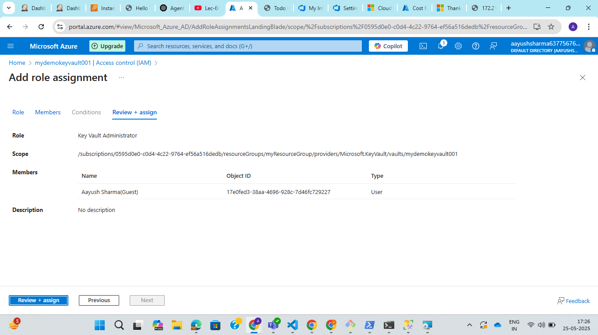
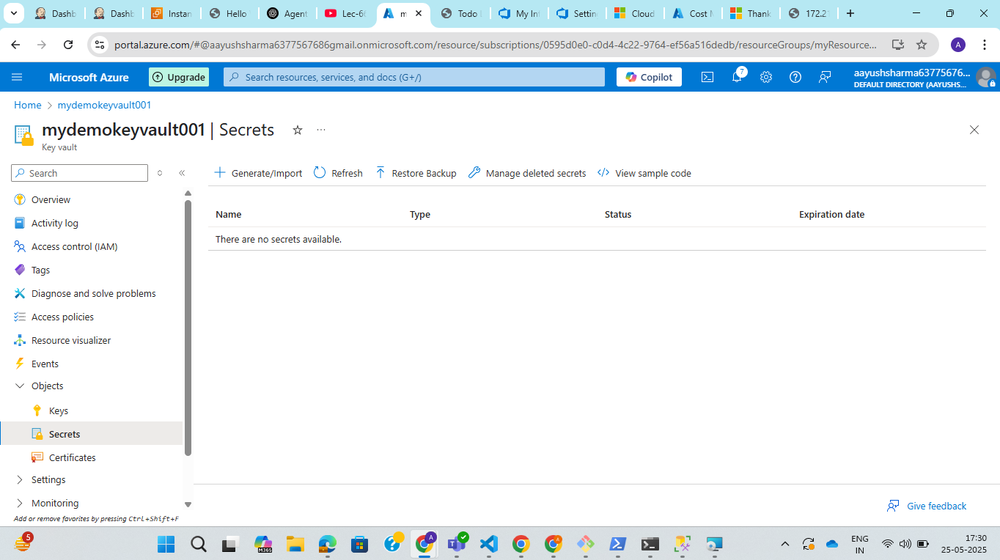

**Assignment: Create an Azure Key Vault and store the following: A certificate, A secret (e.g., a database connection string)**

1. Create Azure key vault:

Step 1: Go to azure portal and cselect key vault service.

Step 2: Click on create key vault and add basic information.

Step 3: Click on review and create.

2. Add self signed certificate.

Step 1: Select objects > certificate in left side bar menu of key vault.

Step 2: Click on Access control(IAM) and click on role assignment.

Step 3: Add role as key vault administrator and select you as member.

Step 4: Click on generate and import and fill in the detials and choose self signed certificate.

Step 5: Certificat is created.

3. A secret

Step 1: Click on object > secret in left side bar menu.

Step 2: Click on generate import secret.

Step 3: Click on create secret.

