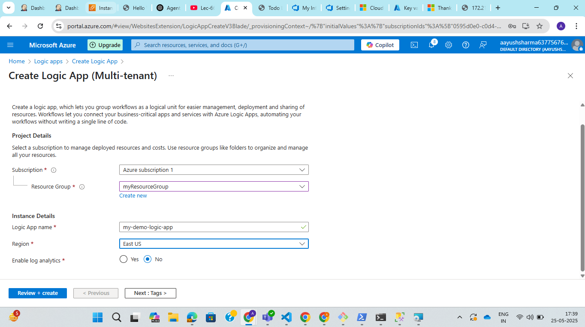
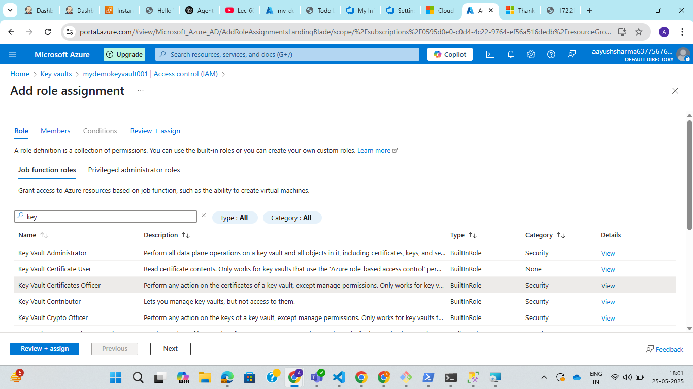

**Assignment : Create a Logic App to rotate the Key Vault access keys every 30 days.**

Step 1: Go to azure portal and search for logic app.

Step 2: Click on create logic app and fill the details like resource group, subscription, logic app name and region(same as azure key vault).

Step 3: Click on review and create.

Step 4: Open the logic app created and click on development tools > logic app designer on left side bar menu.

Step 5: Add actions like Recurrence(Starts the workflow on a schedule), Compose(Generates a new random secret) and http(Updates (or creates a new version of) a secret in your Key Vault).

In logic app code view we can see the actual json format of actions to be performed.

Step 6: Select Settings > Identity system assigned ON.

Why Enable Managed Identity on Logic App?	

To securely authenticate the Logic App to other Azure services without passwords.

Step 7: Go to azure key vault created and select access policy (IAM) in left side menu and select add role assignment.

Step 8: Select key vault certificate officer role.

Step 9: In member section select assign access to member identity as managed identity and click on select member as logic app created.

Why Assign RBAC Role on Key Vault?
	
To grant that identity permission to create/update secrets in the Key Vault

Step 10. Click on review and assign.

Step 11. Now trigger the logic app and check for new version of secret in key vault.

