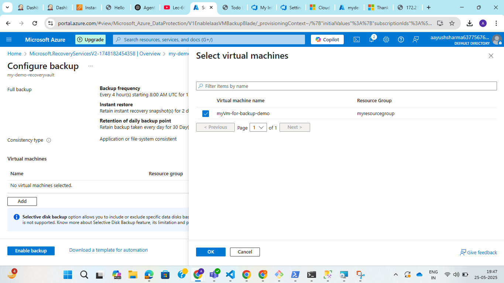

**Assignment: Set up Azure Backup to back up a VM’s disks to a Recovery Services Vault, Restore the VM using the backup image.**

#### Create a VM
Step 1: Go to azure portal and select the virtual machine service.

Step 2: Click on create virtual machine and add basic detials.

Step 3: Click on review and create.

Step 4: SSH into virtual machine and store some data in root folder.

Create recivery service vault
Step 1: Go to azure portal and click recovery service vaults.

Step 2: Click on create recovery vault and fill in basic details.

Step 3: Click on review and create.

Configure Backup for VM
Step 1: Open recovery vault created and click on backup in overview.

Step 2: Fill in the detials in backup goal.

Step 3: Add virtual machine for which you want to backup.

Step 4: Click on enable backup.

Step 5: Click on backup items > select virtual machine > click on 3 dots and select backup now.

Resotre from Backup
Step 1: In the vault, go to Backup Items > Azure Virtual Machine > Select your VM.

Step 2: Click on 3 dots and click on restore VM.

Step 3: Select the snapshot recovered and fill the details for new virtual machine.

Step 4: Click on review and create. Now a new virtual machine is created.

We can see the disk used by new VM is of restore only.