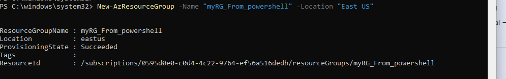
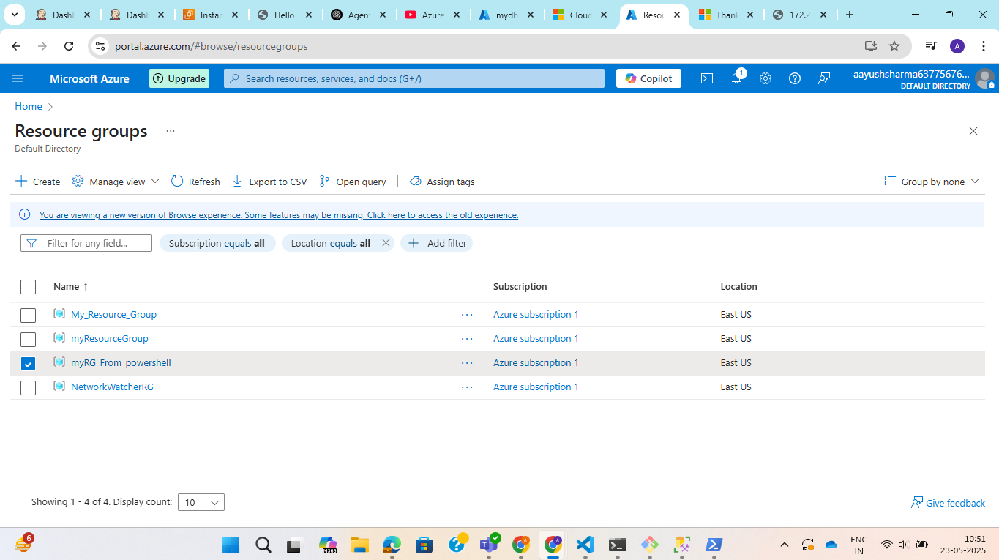
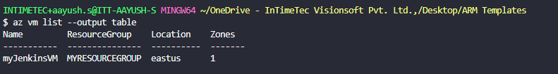
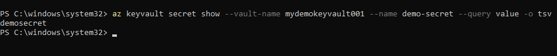

**Assignment 1: Install Azure PowerShell and create an Azure resource using a PowerShell script.**

Install azure powershell on windows.
Run the following commands:

```Install-Module -Name Az -Scope CurrentUser -Repository PSGallery -Force```

```Update-Module -Name Az -Force```

```Connect-AzAccount -DeviceCode```


Create an azure resource using powershell
Run the following command :

```New-AzResourceGroup -Name myRG-from-powershell -Location EastUS```





**Assignment 2: List all VMs in your account using Azure CLI**

Step 1: Run the following command:

```az vm list --output table```



**Assignment 3: Access a Key Vault secret using Azure CLI.**

Step 1: Add secret to key vault.

Step 2: Run the following command on terminal:

```az keyvault secret show --vault-name mydemokeyvault001 --name demo-secret --query value -o tsv```

