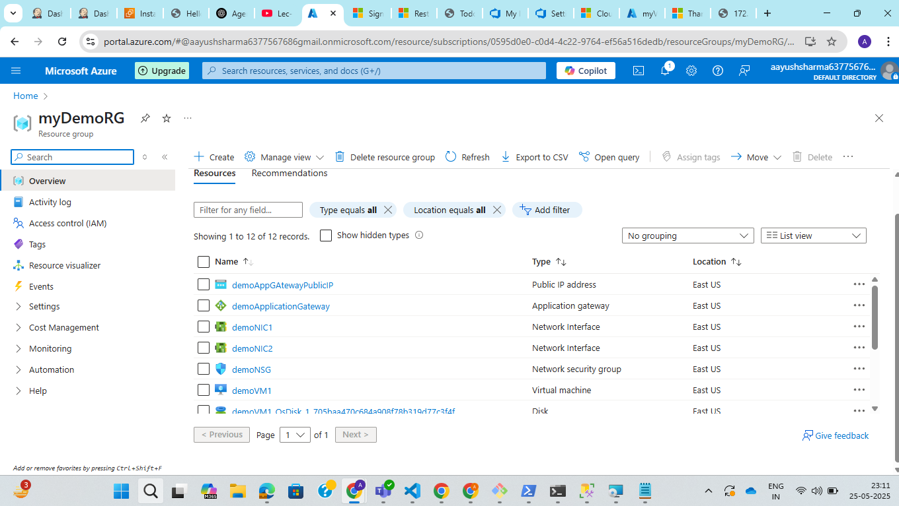
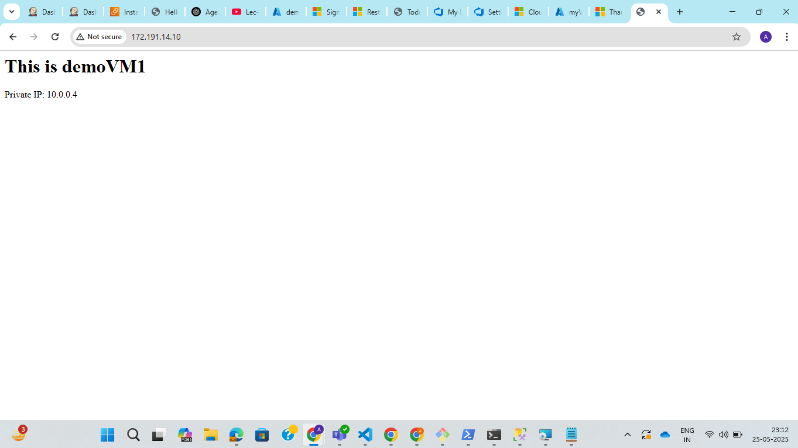
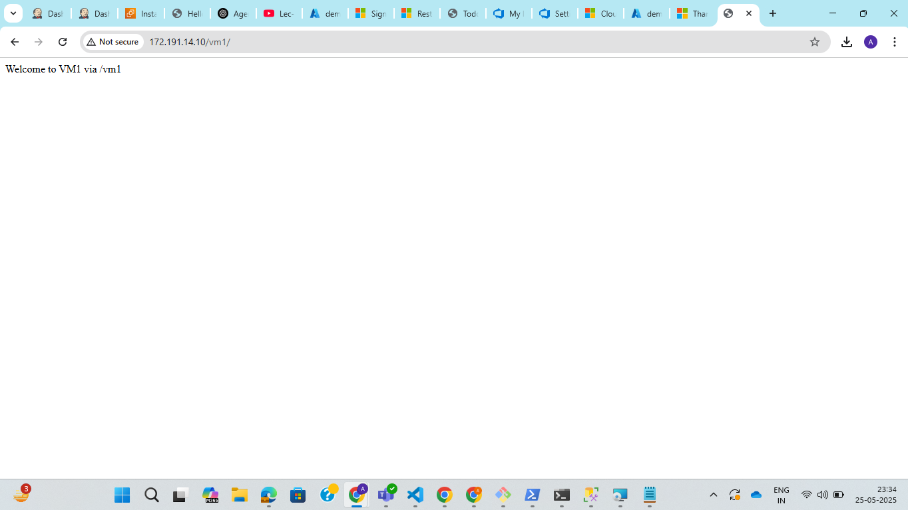

**Assignment: Deploy two static websites in two separate VMs. Place them behind an Application Gateway. Configure path-based routing:/vm1 → Requests go to VM1, /vm2 → Requests go to VM2. Deploy the Resource Group and VMs using: Azure PowerShell, ARM Template**

Step 1: Create an ARM template named azuredeploy.json which includes 2 virtual machine, vnet, 2 subnet (one for virtual machine and one for application gateway), 2 nic for virtual machine and 3 public ip addresses( 2 for virtual machine and 1 for application gateway) and network security group.

Step 2: Create azure powershell script to connect to azure subscription, create a resource group and deploy all the resources from the ARM template.

Step 3: Check for the resources created in azure reource group.

Step 4: Check for application gateway public ip and with path /vm1 and /vm2.

