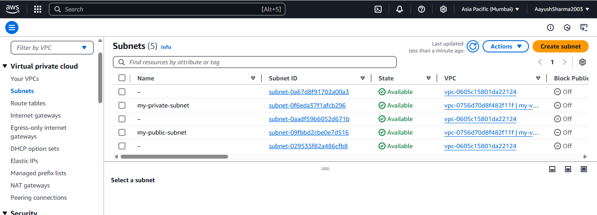

# Steps to Create EC2 Instances in Public & Private Subnets

## Step 1: Create VPC and Subnets
1. **Create VPC**  
   - CIDR: `10.0.0.0/16`  
   - Enable DNS hostnames [5][6]

2. **Create Public Subnet**  
   - CIDR: `10.0.1.0/24`  
   - Enable auto-assign public IPv4 [4][8]
   

3. **Create Private Subnet**  
   - CIDR: `10.0.2.0/24`  
   - Disable auto-assign public IP [2][8]

4. **Set Up Internet Gateway**  
   - Attach to VPC  
   - Add route `0.0.0.0/0 → Internet Gateway` to public subnet's route table [1][4]

5. **Create NAT Gateway**  
   - Place in **public subnet**  
   - Add route `0.0.0.0/0 → NAT Gateway` to private subnet's route table [2][3]

---

## Step 2: Launch Public EC2 Instance

- **Subnet:** Public subnet  
- **User Data Script** (for web server test):  

---

## Step 3: Launch Private EC2 Instance

- **Subnet:** Private subnet  
- **Auto-assign Public IP:** Disabled [8]  
- **User Data Script** (for connectivity test):  

---

## Step 4: Test Configuration
1. **SSH to Public Instance**  

 
2. **SSH to Private Instance**  

3. **Verify Internet Access**  

---
 

 