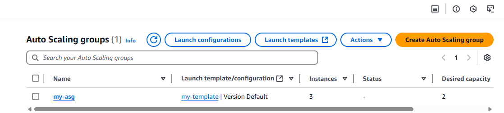

# Steps to Create an Auto Scaling Group of EC2 Instances with CPU-based Scaling

## Step 1: Create Launch Template

1. Navigate to EC2 Dashboard > Launch Templates
2. Click "Create launch template"
3. Configure:
   - AMI: Choose Amazon Linux 2
   - Instance type: t2.micro
   - Key pair: Select existing or create new
   - Network settings: Select VPC and security group
   - Storage: Configure as needed
   - User data (optional):
     ```
     #!/bin/bash
     yum update -y
     yum install -y httpd
     systemctl start httpd
     systemctl enable httpd
     ```

## Step 2: Create Auto Scaling Group

1. Go to EC2 Dashboard > Auto Scaling Groups
2. Click "Create Auto Scaling group"
3. Configure:
   - Name: `MyASG`
   - Launch template: Select the one created in Step 1
   - VPC and subnets: Choose at least two subnets in different AZs
   - Load balancer: Optional, create or select existing
   - Group size:
     - Desired capacity: 2
     - Minimum capacity: 1
     - Maximum capacity: 4

     

## Step 3: Configure Scaling Policies

1. In the Auto Scaling group creation wizard, go to "Configure group size and scaling policies"
2. Select "Target tracking scaling policy"
3. Configure:
   - Policy name: `CPU-Based-Scaling`
   - Metric type: Average CPU utilization
   - Target value: 50 (percent)
   - Instance warmup: 300 seconds

## Step 4: Review and Create

1. Review all settings
2. Click "Create Auto Scaling group"

## Step 5: Verify and Monitor

1. Check EC2 Dashboard to see instances launching
2. Monitor CloudWatch metrics for CPU utilization
3. Test scaling:
   - Increase load to trigger scale-out
   - Decrease load to observe scale-in

 
---
 