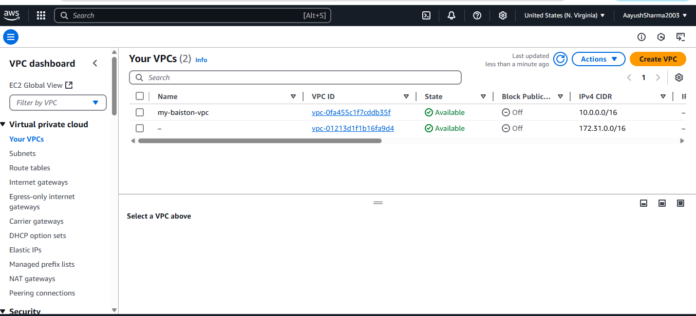
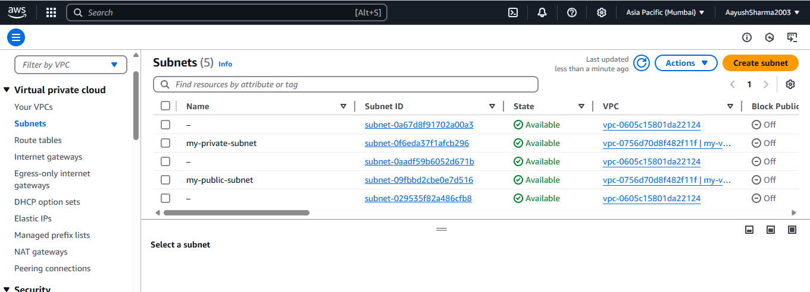

# Steps to Create a VPC with Public and Private Subnets

## Step 1: Sign in to AWS Console
- Log in to your AWS Management Console.

### Navigate to VPC
- Search for and select **VPC**.

### Create a VPC
- Click **Your VPCs > Create VPC**.
- Name it and set IPv4 CIDR (e.g., 10.0.0.0/16). Click **Create**.

## Step 2: Create Public Subnet
- Click **Subnets > Create subnet**.
- Select your VPC, name it (e.g., PublicSubnet), set CIDR (e.g., 10.0.1.0/24), and choose an AZ. Click **Create**.

### Create Private Subnet
- Click **Create subnet** again.
- Select your VPC, name it (e.g., PrivateSubnet), set CIDR (e.g., 10.0.2.0/24), and choose an AZ. Click **Create**.

.png)

## Step 3: Create Internet Gateway
- Click **Internet Gateways > Create internet gateway**.
- Name it, click **Create**, and attach it to your VPC.

### Update Route Table for Public Subnet
- Select the public subnet's route table.
- Add a route for `0.0.0.0/0` targeting the Internet Gateway. Save changes.

## Step 4: Configure Subnet Association
- Edit the subnet associations for the route table, select the public subnet, and save.
