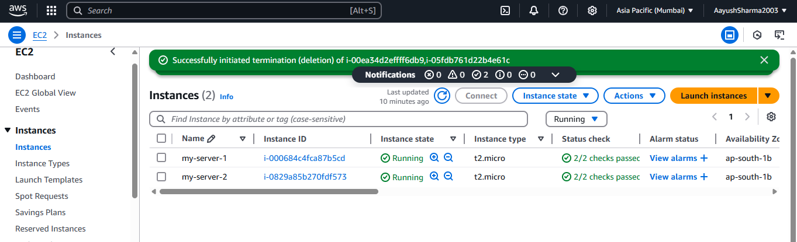

# Steps to Launch EC2 Instance

## Step 1: Sign in to AWS Console
- Log in to your AWS Management Console.

### Select Region
- Change the region to **Asia Pacific (Mumbai) - AP-South-1**.

## Step 2: Launch EC2 Instance
- Go to **EC2 > Instances > Launch Instance**.

## Step 3: Choose AMI
- Select an **Amazon Machine Image (AMI)** (e.g., Amazon Linux 2).

### Choose Instance Type
- Select the instance type (e.g., `t2.micro`) and click **Next: Configure Instance Details**.

## Step 4: Configure Instance
- Keep the default settings and click **Next: Add Storage**.

## Step 5: Add Storage
- Set the size to **7 GB** for the root EBS volume. Click **Next: Add Tags**.

## Step 6: Add Tags (Optional)
- Add any tags if needed, then click **Next: Configure Security Group**.

## Step 7: Configure Security Group
- Create a new security group or select an existing one.
- Add a rule for SSH (port 22):
  - **Type:** SSH  
  - **Protocol:** TCP  
  - **Port Range:** 22  
  - **Source:** Specify your network's CIDR (e.g., `192.168.1.0/24`).

## Step 8: Review and Launch
- Review your settings and click **Launch**.
- Select or create a key pair for SSH access and acknowledge the prompt.

## Step 9: Launch Instance
- Click **Launch Instances**.

---

 