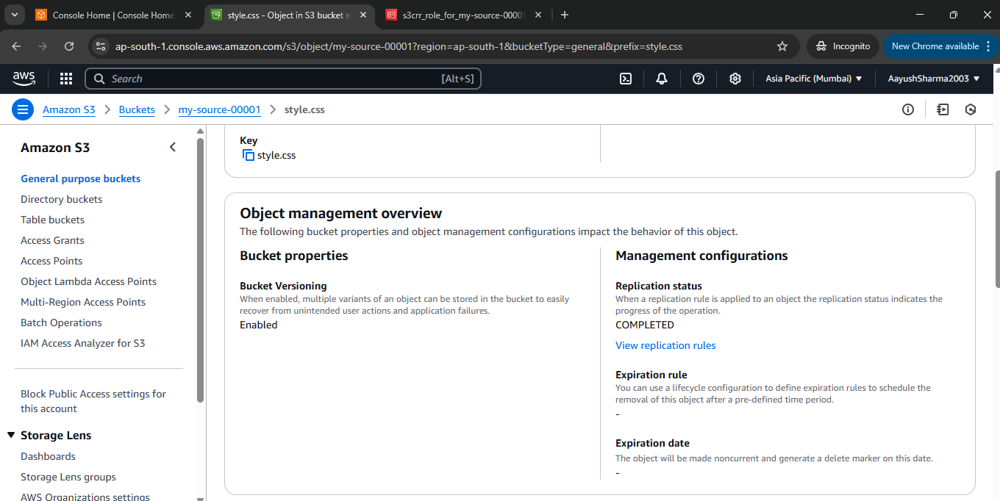

# Steps to Create S3 Bucket with Versioning and KMS Encryption

## Step 1: Sign in to AWS Console
- Log in to your AWS Management Console.

## Step 2: Navigate to S3
- Search for and select **S3**.

## Step 3: Create S3 Bucket
- Click **Create bucket**.
- Enter a unique bucket name and select a region.
- Click **Create**.

## Step 4: Enable Versioning
- After creating the bucket, go to the **Properties** tab.
- Under **Bucket Versioning**, click **Edit**.
- Enable versioning and click **Save changes**.

## Step 5: Set Bucket Policy
- Go to the **Permissions** tab of your bucket.
- Click on **Bucket Policy** and enter the following JSON policy:
- Replace `your-bucket-name` with your actual bucket name.

## Step 6: Save Policy
- Click **Save** to apply the bucket policy.

---
