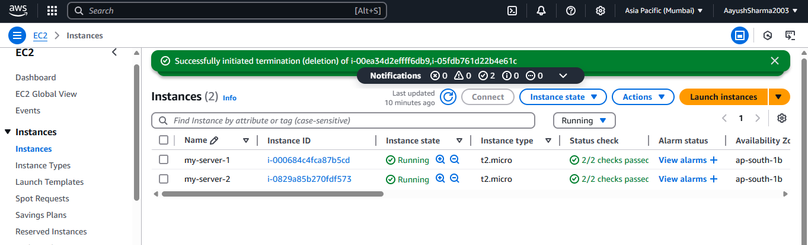

# Steps to Launch ALB and Configure Load Balancing

## Step 1: Launch EC2 Instances

### 1. Sign in to AWS Console
- Log in to your AWS Management Console.

### 2. Select Region
- Change the region to **Asia Pacific (Mumbai) - AP-South-1**.

### 3. Launch EC2 Instances
- Go to **EC2 > Instances > Launch Instance**.
- Choose an AMI (e.g., **Amazon Linux 2**).
- Select an instance type (e.g., `t2.micro`).
- Configure instance details:
  - Ensure instances are launched in **different Availability Zones** within the same VPC for high availability[1][3].
- **Advanced User Data Script** (Optional):  
- Launch **two instances** and note their IDs.

---

## Step 2: Create an Application Load Balancer

### 4. Navigate to EC2 Dashboard
- In the left sidebar, select **Load Balancers**.

### 5. Create Load Balancer
- Click **Create Load Balancer** and select **Application Load Balancer**.

### 6. Configure Load Balancer
- **Name:** `my-alb`  
- **Scheme:** Internet-facing  
- **VPC:** Select your VPC  
- **Subnets:** Choose **at least two public subnets in different Availability Zones**[3][6].

### 7. Configure Security Settings
- For HTTPS:  
- Upload or request an SSL/TLS certificate via **AWS Certificate Manager (ACM)**.

### 8. Configure Security Groups
- Create a new security group allowing:
- **Inbound:** HTTP (port 80) / HTTPS (port 443)  
- **Outbound:** All traffic to instances[4].

### 9. Configure Routing
- **Target Group:**  
- Name: `my-targets`  
- Protocol: HTTP  
- Port: 80  
- Health Check Path: `/index.html` (default: `/`)[3][5].

### 10. Register Targets
- Select the two EC2 instances launched earlier.
- Ensure **port 80** is specified for both.

### 11. Review and Create
- Verify all settings and click **Create**.

---

## Step 3: Test the Load Balancer

### 12. Validate Configuration
- Wait for the ALB status to show as **Active** (takes 1-2 minutes).
- Check **Target Group > Health Status** to confirm instances are **healthy**[1][6].

### 13. Access the ALB
- Copy the ALB’s **DNS Name** (e.g., `my-alb-123456789.ap-south-1.elb.amazonaws.com`).
- Paste the DNS name into a web browser. You should see the test page from your EC2 instances.

---

 
